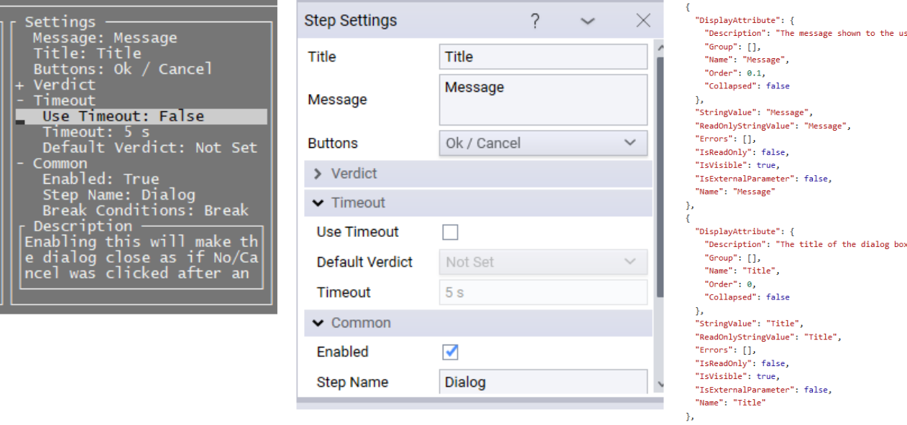

Annotations
=============================

The annotations system is a flexible way to describe object interactions between users and OpenTAP. It provides a way to dynamically generate a UI model, that can be used in multiple different GUI application to create a unified user experience. 

Common elements of user interactions are for example text boxes, check-boxes and drop-downs. These elements are abstracted in the annotation system, without explicitly stating which kinds should be used. This is not the easiest way to create user interfaces, but it ensures the same interactivity across User Interfaces like Graphics User Interfaces, Remoting APIs and text based user interfaces. It is a powerful abstraction because it allows defining new user interactions without resorting to writing any specific GUI code. 

An 'annotation' describes an aspect of an object in relation to known user interactions. One such aspect could be e.g the name of a property or the fact that its value should be selected from a list of available values. Objects are described by multiple of such annotations. A model of an object or property is abstracted into the ```AnnotationCollection``` class. This class is a collection of annotations for the object, describing it in all currently available ways. Additional classes can be added to the annotation by plugins called 'annotators'. 

||
| :-: |
||
|*Annotated test step settings for a text/terminal based, a WPF based GUI and a JSON WEB API. The views are based on data from the same type of Test Step. Each view has the same properties and the same annotations, but different technologies are being used to show them.*|

The annotation system has two sides to it, the User Interface and the Plugin side. This section will mostly focus on the plugin side of this. For a complete example of how to implement a User Interface using the annotation system the open-source text based user interface can be used as a reference. It is located at [https://gitlab.com/OpenTAP/Plugins/keysight/opentap-tui](https://gitlab.com/OpenTAP/Plugins/keysight/opentap-tui).

For plugin developers the annotation system can be used to extend the number of types that the user can interact with in the GUI.

For example, for a given type, let's say an IPAddress, a "String Value Annotation" can be implemented to enable editing an IP in a text box. If it is also wanted to have a drop-down of pre-selected values, the "Suggested Values Annotation" can be used. For the concrete example see `IPAnnotation.cs` in the SDK Examples.

GUIs are looking for annotation interface implementations to know if they can display a given annotation to the user. For example, if a GUI application can find String Value Annotation in the list of annotations for given property, then it can display that property as a text box.   

The following are the most commonly implemented types of annotations:

| Interface | Name | Description |
| -------- | --------- | -------------------- |
| IStringValueAnnotation | String Value Annotation | Used for properties that can be edited as text. Most commonly a single line of text. This is used for numbers, text, dates, time spans, URLs. |
| IStringReadOnlyValueAnnotation | Read-only String Value Annotation | Used for items that maybe cannot be edited as a string, but the current value can be read as a string. This is for example useful for things that might appear in a drop-down. |
| IAvailableValuesAnnotation | Available Values Annotation | Used for editing properties based on a selection of available values. This is commonly used for DUTs, instruments and enums. |
| ISuggestedValuesAnnotation | Suggested Values Annotation | Used along with the IStringValueAnnotation. Allows the user to select from a list of suggested values as well as inserting a custom value. |  
| IMultiSelect | Multi Select Annotation | Usage is very similar to Available values annotation, but multiple values can be selected simultaneously. This annotation must also appear with an Available Values Annotation as it only specfies how to select multiple items and not how to list them. |
| IMemberAnnotation | Member Annotation | Provides reflection information for a given member this is often used by the code annotating properties, but not implemented directly. |
| DisplayAttribute | Display Attribute Annotation| Attribute used to describe classes and properties. This is commonly used in plugin code and is also an IAnnotation. | 
| HelpLinkAttribute | Help Link Attribute Annotation| Provides a help link for a given class or property. |
| **Less Used Annotations** |||
| IStringExampleValueAnnotation| String Example Value Annotation | Used to provide extra information about a string. This is often used along with macros to provide the expanded macro string to the user.|
| IErrorAnnotation | Error Annotation | Used to provide data errors to the user interface. Validation errors are implemented this way. Custom new types of errors can be added by extending it. |
| IAccessAnnotation | Access Annotation | Used to define whether the user has write or view access to a property. |
| IEnabledAnnotation | Enabled Annotation | Used to specify whether a property should be enabled |
| IBasicCollectionAnnotation | Basic Collection Annotation| Used to specify that something should be edited as a collection of items. This normally means it should be shown as a data grid. |
| IFixedSizeCollectionAnnotation | Fixed Size Collection Annotation | Can be used to specify if a collection has fixed size. Meaning if elements can be added or removed. |
| IValueDescriptionAnnotation | Value Description Annotation | Can be used to provide a more thorough description of the value of an object. These values usually show up in tooltips. |
| IMembersAnnotation | Members Annotation | Used to specify that an object has members that can also be edited. Each of the members are annotated themselves. This interface is very complicated to implement, if dynamic members for a given type need to be implemented, it would normally be better to specify a custom ITypeData/ITypeDataProvider. | 
 
 Some of these annotation types have a corresponding 'proxy' interface. The proxy interface is there to wrap the simpler non-proxy variants in a manner that is usable from the user interface. They don't need to be considered unless developing a user interface.
 
 The static method ```AnnotationCollection.Annotate``` is used to build the AnnotationCollection object. A plugin type called an "annotator" (```IAnnotator```) is the definition of classes that can be used to provide annotations for a given object. To use custom annotations an ```IAnnotator``` must be implemented to specify where the custom annotations should be inserted. A number of annotators exist and they need to be applied in a specific order, therefore the ```IAnnotator.Priority``` Property is used to control the order in which annotations are being applied. Normally, this value should just be set to '1'.
 
  
 ## Custom Controls and Annotations
 
 Various GUI implementations support writing new custom controls. To support this it might also be necessary to create custom annotation types. Both things are possible, but it is generally discouraged, since existing GUIs cannot know about these new annotations. If new annotation types or new types of controls are needed we encourage starting a discussion on the OpenTAP repository at [gitlab.com/opentap/opentap](https://gitlab.com/opentap/opentap). This way, we can ensure that plugins are broadly supported across multiple user interfaces. 
