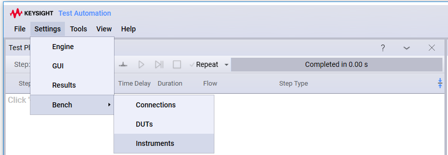

Component Setting
=================
## Global and Grouped Settings

In addition to the settings defined for test steps, DUTs, and instruments, there are several "built in" settings collections. These can be divided into two categories: *Global* and *Grouped*. 

 - **Global** settings are shown under the **Settings** menu. At a minimum, you will find settings for the **Engine**, **Editor**, and **Results**.
 - **Grouped** settings are applicable to a particular configuration profile and are shown under the **Settings > GroupName** menu.  The Bench settings (shown under the **Settings > Bench** menu) is an example of grouped settings. 



### Creating a New Global/Grouped Settings Dialog
OpenTAP developers can create their own settings dialogs under the **Settings** or **Settings > GroupName** menus. By default, the dialog appears under the **Settings** menu. If the class is decorated with the `[SettingsGroup("GroupName")]` attribute, the dialog will appear under the **Settings > GroupName** menu. It is also possible to extend the bench settings by decorating a class with the `[SettingsGroup("Bench")]` attribute.

### Single Instance of Multiple Different Settings
If you want to create a dialog consisting of multiple settings, you should inherit from the ComponentSettings class. See the `TAP_PATH\Packages\SDK\Examples\PluginDevelopment\GUI\ExampleSettings.cs` file. The result looks like this:


### List of Similar Settings
Suppose you are trying to list several objects that are slightly different but share a common base class. This is similar to what is used in the DUT or Instrument settings dialog. To do so, you should inherit from the ComponentSettingsList class. See the CustomBenchSettings.cs file. The results (with several instances created), are shown below:


## Reading and Writing Component Settings

The SettingsRetrieval.cs file demonstrates different approaches for reading component settings, as shown in the code below:

```csharp
[Display("Settings Retrieval", Groups: new[] { "Examples", "Feature Library", "Step Execution" }, Order: 10000, Description: "Shows how to retrieve settings.")]
public class SettingsRetrieval : TestStep
{
    public override void Run()
    {
        // These settings always exist
        Log.Info("Component Settings directory={0}", ComponentSettings.SettingsDirectoryRoot);
        Log.Info("Session log Path={0}", EngineSettings.Current.SessionLogPath);
        Log.Info("Result Listener Count={0}", ResultSettings.Current.Count);

        if (DutSettings.Current.Count > 0)
        {
            string s = DutSettings.GetDefaultOf<Dut>().Name;
            Log.Info("The first dut found has a name of {0}", s);
        }

        if (InstrumentSettings.Current.Count > 0)
        {
            string s = InstrumentSettings.GetDefaultOf<Instrument>().Name;
            Log.Info("The first instrument found has a name of {0}", s);
        }

        // An example of user defined settings, which show up as individual tabs
        // Default values will be used, if none exist.
        Log.Info("DifferentSettings as string={0}", ExampleSettings.Current.ToString());

        // An example of custom Bench settings.
		// This is similar to the DUT or Instrument editors.
		// Only use the values if something exists.
		if (CustomBenchSettingsList.Current.Count > 0)
		{
			Log.Info("Custom Bench Settings List Count={0},CustomBenchSettingsList.Current.Count);
			Log.Info("First instance of Custom Bench setting as string={0}",
				   CustomBenchSettingsList.GetDefaultOf<CustomBenchSettings>());
			foreach (var customBenchSetting in CustomBenchSettingsList.Current)
			{
			    Log.Info("Type={0} Time={1} MyProperty={2}", customBenchSetting.GetType(), 
				customBenchSetting.MyTime, customBenchSetting.MyProperty);
			}
        }
    }
}
```
## Connection Management

An OpenTAP *connection* represents a physical connection between Instrument and/or DUT ports. A *physical connection* is modeled in **software** by creating a class that extends the **OpenTap.Connection** abstract base class.

A *port* is the endpoint of a connection. Ports are often defined on Instruments or DUTs to represent physical connectors. An instrument or DUT can have an arbitrary number of ports.

OpenTAP comes with a number of predefined connections. These include:

-	**RfConnection**, which extends the OpenTAP.Connection class, consists of two ports (inherited from the OpenTAP.Connection), and adds the concept of CableLoss, which is a list of LossPoints. An RfConnection represents a physical RF cable with known loss characteristics by using the list of loss points to represent the cable loss at different frequencies.
-	**DirectionalRfConnection**, which extends the RfConnection class to include direction.

For more information, see the *Bench Settings - Connections* topic in the GUI Editor help, or contact support.
