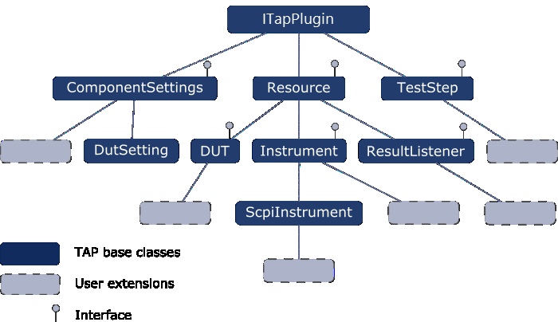
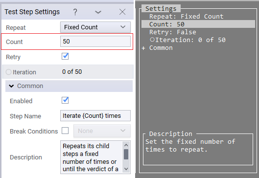

Development Essentials
==================

## OpenTAP Plugin Object Hierarchy

At the very root of the OpenTAP plugin class hierarchy is the **ITapPlugin** class. Items in blue are OpenTAP base classes. The green, dotted rectangles are user extensions to those base classes.

 
 
 Extending **ITapPlugin** are the **ComponentSettings**, **Resource**, and **TestStep** base classes. These are abstract classes and hence cannot be instantiated. They are used as base classes for other classes.
 
-	**ComponentSettings** is used for storing settings throughout the system. It contains properties to be set or lists of instruments, DUTs, and so on. ComponentSettings are available via the various Settings menus in the GUIs.

-	**Resource** is a base class for the DUT, Instrument and ResultListener classes. Resources are often specified in the settings for a test step. Referencing a 'Resource' from a test step will cause it to automatically be opened upon test plan execution. 

-	**TestStep** does not inherit from Resource but inherits directly from ITapPlugin.

## Developing Using Interfaces

Developers may choose to NOT extend the OpenTAP base classes, but instead to implement the required interfaces. You can inherit from as many interfaces as you want, but from only one class. The TestStepInterface.cs file provides an example of implementing ITestStep.

Developers implementing IResource (required by virtually all other OpenTAP plugin classes), must ensure that the implementation of:

-	IResource.Open sets IsConnected to true, and 
-	IResource.Close sets IsConnected to false.

## Working with User Input

It is possible to request information from the user via the `UserInput` class. You can use this in both the CLI and a GUI. In a GUI, this allows you to create a pop-up dialog the user can interact with.

The `UserInput.Request` method takes three parameters:

- `dataObject` - the object the user needs to provide. Can be a test step, an instrument or a DUT among others.
- `Timeout` - specify how long to wait for the user input. After the specified amount of time an exception will be thrown.
- `modal` - a Boolean that specifies if the user can interact with background objects if the dialog is open. If it is set to true the user will have to answer before doing anything else.

To finalize the input you can use the [`SubmitAttribute`](../Attributes/Readme.md#submit-attribute). If this is used in a GUI with an enum, buttons appear that can submit or cancel the user input. In this case we recommend using the `SubmitAttribute` together with the [`LayoutAttribute`](../Attributes/Readme.md#layout-attribute). This helps to create a natural look-and-feel for your UI because it handles how the buttons are displayed. You can use this attribute to control the height, width and placement of the buttons. To give a title to your dialog box you can use the `Create Name` property.

## Plugin Settings

Adding user settings to a *TapPlugin*, such as a step setting for a test step, can be done with properties.
These properties are visible and editable in the GUI Editor. Properties typically include instrument and DUT references, instrument and DUT settings, timing and limit information, etc. Defining these properties is a major part of plugin development.

An example from the repeat step: 
```cs
[EnabledIf("Action",RepeatStepAction.Fixed_Count, HideIfDisabled = true)]
[Display("Count", Order: 1, Description: "Set the fixed number of times to repeat.")]
public uint Count { get; set; }
```
Turns into:



The SDK provides many examples of properties for test step development in the **`TAP_PATH\Packages\SDK\Examples\PluginDevelopment\TestSteps`** folder.

A C# property has a type, a name and a visibility specifier. The most basic setting has just these three components. By default the property must have public visibility to be configured by the user - otherwise it is not considered a setting.  
A very typical example could look like this:
```cs
public double TxFrequency { get; set;} = 1e9; // A transmission frequency of 1 GHz.  
```
Let's break this down.
 - `public`: This means that this property can be seen from outside the scope of the class. This can also be set to private, protected or internal, but in these cases they are not considered 'settings' and won't show up in UIs and won't be saved in the test plan file. 
 - `double`: The type of the property. In this case this is a decimal value with 64 bits of precision. Here anything can be specified and it will show up in the user interface, but displaying it or configuring it may not always be possible - it has to be a type supported by the installed plugins. By default the following types are supported
   - float, double, decimal - Respectively 32-, 64- and 128-bit precision decimal values.
   - integer types - short, ushort, int, uint, long, ulong, byte - various precision integer types.
   - string - a string of text.
   - bool - A true / false value. This is often shown as a checkbox.
   - enums - A list of selectable values. This is often shown as a drop down.
   - Resources - A selectable resource type, e.g Instrument, DUT, ... This will be restricted by the selected subtype of resource, e.g ScpiInstrument is a specialization of Instrument and hence only ScpiInstrument types will be available in the dropdown. 
   - Lists - A editable list of objects. Often shown as a data grid or spreadsheet.
   - TimeSpan - A span of time. e.g 1 hour. This is shown as a text box.
   - Enabled`<T>` - An enable setting encapsulating another type. This is shown as a checkbox followed by something else.
 - `TxFrequency`: The name of the property. By default this is what will be presented to the user.
 - `{get;set;}`: Specifies that this is a C# property. 'set' can be omitted to make it read-only.
 - `= 1e9`: Specifies the default value of this property. 

### Setting Attributes

Attributes can be used to further improve the behavior of the property. For a full list of default supported attributes, see [Attributes Used by OpenTAP](../Attributes/Readme.md#attributes-used-by-opentap).

In the example seem above, we could further improve the usability by adding some attributes.

```cs
// Specify that the user-friendly name is "Transmission Frequency" and provide a tooltip.
// furthermore, the group is set to "DUT", which means the setting will be added to a group called "DUT".
[Display("Transmission Frequency", "Transmission frequency configured on the DUT. This should be between 500MHz and 2GHz.", "DUT")]
// Specify that the unit is hertz, Hz.
[Unit("Hz")]
public double TxFrequency { get; set;} = 1e9;  
```

### Best Practices For Settings
Any code can be evaluated in property getters and setters, but this can often be the source of bugs and performance issues.

1. Keep it simple: Don't use complex behavior in property setters as this can cause subtle bugs and performance issues. Avoid setting other properties' backing value in a property setter. If you want to be able to configure a preset of values, consider adding a button.
2. Use validation rules for signaling invalid configurations.
3. Use a guard clause to check the value before calling expensive update functions.
   ```cs
      public double TxFrequency 
      { 
         get => txFrequency;
         set 
         {
            if (value == txFrequency) return; // early return.
            txFrequency = value;
            OnPropertyChange(nameof(TxFrequency)); // Expensive operation.
         }
      }
   ```

## Best Practices for Plugin Development

The following recommendations will help you get your project off to a good start and help ensure a smooth development process:

-	You can develop one or many plugins in one C# project. The organization is up to the developer. The following is recommended:
    -	Encapsulate your logic. Keeping all instrument logic inside the instrument class makes it possible to swap out instruments without changing TestSteps. For example, a TestStep plugin knows to call **MeasureVoltage**, and the instrument plugin knows how to get that measurement from its specific instrument.  
    -	You can put Instruments, DUTs, and TestSteps all in separate packages and create a "plug-and-play" type of interaction for test developers. For example, you can create test steps that make a measurement and plot a result. If done properly, the steps work regardless of which instrument gets the data or what type of device is being tested.

-	Don't introduce general settings unless absolutely necessary. Instead try to move general settings to test steps (such as a parent step holding settings for a group of child steps) or to DUT or Instrument settings.

-	For DUTs, Instruments, and Result Listeners, set the Name property in the constructor, so that this Name appears in the Resource Bar.

-	Use the **Display** attribute (with a minimum of name and description) on properties and classes. This ensures good naming and tooltips in the GUI Editor.

-	Use **Rules** for input validation to ensure valid data.

## Embedding OpenTAP in other Applications   
It is possible to embedd OpenTAP in custom applications and tools such as operator UIs. In this case, it is important to properly load and reference OpenTAP DLLs and install locations in order to keep the custom applications isolated if support for side-by-side installs of OpenTAP is desired.   
    
Mainly, this invovles how the OpenTAP DLL is discovered. This can be done in a few different ways:   
   
- When running within a tap.exe process:     
    - `OpenTap.PluginManager.GetOpenTapAssembly().Location;`     
    - `System.Reflection.Assembly.GetEntryAssembly().Location;`   
        
- Outside the tap.exe process:   
    - It is recommended to find the install path using a registry key. The registry key that this generates should be in `HKEY_LOCAL_MACHINE\SOFTWARE\Keysight\Test Automation\Installations` or `HKEY_CURRENT_USER\SOFTWARE\Keysight\Test Automation\Installations` depending on whether `tap path register` / `tap package install OSIntegration` was running elevated (like e.g. during in a KS8400 installation).     
    - You can look this Registry Key up from code using the standard .NET API: `Registry.LocalMachine.OpenSubKey`   
     
- From the CLI you can us the OS Integration Package:   
    ```
    > tap package install OSIntegration
    Downloaded 'OSIntegration' to 'c:\git\opentap\bin\Debug\PackageCache\OSIntegration.1.3.0+f4db057d.TapPackage'. 
    [616 ms]
    Installing to C:\git\opentap\bin\Debug
    Installed OSIntegration version 1.3.0+f4db057d [833 ms]
    > tap path register .  // not actually necessary in this case as installing the package automatically does this
    Registered installation in c:\git\opentap\bin\Debug.
    > tap path list
    OpenTAP  c:\git\opentap\bin\Debug
    OpenTAP  C:\git\tap\bin\Debug
    TAP_PATH C:\Program Files\Keysight\Test Automation
    OpenTAP  c:\Program Files\OpenTAP
    ```  
   
- If desired, you can set a custom path as part of a Package Action on Plugin install:
```xml
 <PackageActionExtensions>
     <ActionStep ActionName="install" ExeFile="cmd" Arguments="/c setx MY_UTIL_INSTALL_DIR %cd%"/>
</PackageActionExtensions>	
 ```   

  
Note that the environment variable TAP_PATH may exist, however, this is for legacy reasons only and should **NOT** be used.