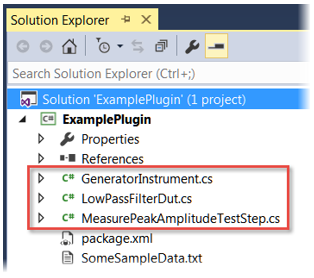
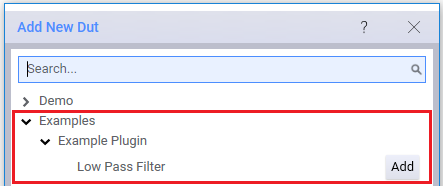
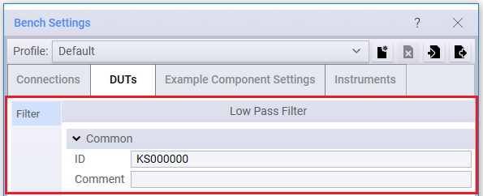
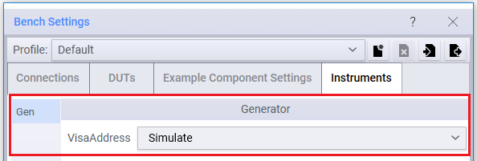
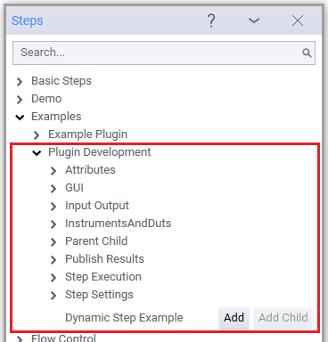
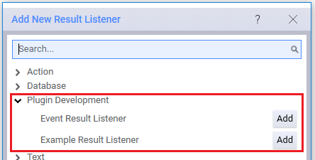

# Getting Started

When creating an OpenTAP plugin you are essentially creating a `dll` that implements specific OpenTAP plugin types, such as the test step or DUT types. The `dll` can enforce one or more plugin types and it can be packaged and versioned, thus [creating an OpenTAP package](../Plugin%20Packaging%20and%20Versioning/Readme.md) with the `.TapPackage` file extension that you can share with the community using the package manager.

To make it easier to develop plugins we created two options you can choose from when creating a project and plugin templates:

- Using the OpenTAP NuGet Package - This is the recommended way to get OpenTAP if you are developing plugin projects. The NuGet package is available on [nuget.org](https://www.nuget.org/packages/OpenTAP/).
- Using the OpenTAP SDK Package - This provides templates for many types of common OpenTAP plugins and can be used via:
  - The **OpenTAP Visual Studio Integration** - This allows you to use Visual Studio to create your plugins. You need Visual Studio 2015, 2017 or 2019. If you are using the KS8400A PathWave Test Automation Developer's System, this is already included. Otherwise, it can be downloaded from the the [Visual Studio Marketplace](https://marketplace.visualstudio.com/items?itemName=OpenTAP.opentapsdkce).
  - The **Command Line** - This allows you to create project code templates from the command line. You can learn how in [The OpenTAP SDK Templates](#opentap-sdk-templates) section.

## OpenTAP NuGet Package

The OpenTAP NuGet Package has several helpful features for plugin development. You can start a new project or you can turn an existing project into a plugin. Any C# project (\*.csproj) can be turned into a plugin project by adding a reference to the OpenTAP NuGet package. 

### Create a Project

You need a C# project to hold your plugin classes. This can be an existing project, or you can start a new one. To start a new one we recommend choosing "Class Library (.NET Standard)" in the Visual Studio "Create a new project" wizard.

### Reference OpenTAP

Since the OpenTAP NuGet package is available on [nuget.org](https://www.nuget.org/packages/OpenTAP/) Visual Studio lists it in the "Browse" tab of the NuGet package manager. You can get to that by right clicking your project in the Solution Explorer and selecting "Manage NuGet Packages...". In the NuGet package manager, search for OpenTAP, and click install.

### OpenTAP NuGet Features

The OpenTAP NuGet package has a couple of additional built-in MSBuild features. These are discussed below.

#### OpenTAP Installation

When your project references the NuGet package, OpenTAP will automatically be installed in your project's output directory (e.g. bin/Debug/). The installation will be the version of OpenTAP specified in your project file (e.g. using the VS NuGet package manager as described above). This feature makes it easier to manage several plugins that may target different versions of OpenTAP. The version of OpenTAP is recorded in the \*.csproj file, which should be managed by version control (e.g. git), so all developers use the same version.

#### OpenTAP Package Creation

The NuGet package also adds build features to help packaging your plugins as a \*.TapPackage for distribution through OpenTAP's package management system (e.g. by publishing it on [packages.opentap.io](http://packages.opentap.io)). To take advantage of these features, your project needs a [package definition file](../Plugin%20Packaging%20and%20Versioning/Readme.md) (normally named package.xml). You can use the command line `tap sdk new packagexml` to generate a skeleton file. As soon as a file named package.xml is in your project, a TapPackage will be generated when it is built in Release mode. You can customize this behavior using these MSBuild properties in your csproj file:

```xml
<OpenTapPackageDefinitionPath>package.xml</OpenTapPackageDefinitionPath>
<CreateOpenTapPackage>true</CreateOpenTapPackage>
<InstallCreatedOpenTapPackage>true</InstallCreatedOpenTapPackage>
```

#### Reference Other OpenTAP Packages

When using the OpenTAP NuGet package, you can reference other TapPackages you need directly. TapPackages referenced like this will be installed into your projects output directory (e.g. bin/Debug/) along with OpenTAP itself.

You can specify an OpenTAP package that your project should reference. When doing this any .NET assemblies in that packages are added as references in your project. You do this by adding the following to your csproj file:
```xml
<ItemGroup>
  <OpenTapPackageReference Include="DMM API" Version="2.1.2" Repository="packages.opentap.io"/>
</ItemGroup>
```
This should be very similar to the way you add a NuGet package using `<PackageReference>`. `Version` and `Repository` are optional attributes, and default to latest release, and packages.opentap.io if omitted.

You can also specify a package that you just want installed (in e.g. bin/Debug/) but don't want your project to reference. This can be useful for defining a larger context in which to debug. It is done as follows:
```xml
<ItemGroup>
  <AdditionalOpenTapPackage Include="DMM Instruments" Version="2.1.2" Repository="packages.opentap.io"/>
</ItemGroup>
```

## OpenTAP SDK Package

The Software Development Kit (SDK) package demonstrates the core capabilities of OpenTAP and makes it faster and simpler to develop your solutions. It contains code example files and an MSBuild task to ease the creation of `.TapPackage` files. It also contains the Developer Guide which contains documentation relevant for developers.

The package can be downloaded from [packages.opentap.io](http://http://packages.opentap.io/index.html#/?name=SDK). Once you downloaded the package you can use the CLI to run the following command and install the package:
```
tap package install sdk.version.TapPackage
```
If you are using the Keysight Developer's System (Community or Enterprise Edition) you already have the SDK package.

### OpenTAP SDK Templates

The OpenTAP SDK makes it easy to create plugin templates using the `tap sdk new` group of subcommands. From the command line you can call the following subcommands:

| Commands                           | Description                                                                                         |
|------------------------------------|-----------------------------------------------------------------------------------------------------|
| **tap sdk new cliaction**              | Create a C# template for a CliAction plugin. Requires a project.                                    |
| **tap sdk new dut**                    | Create a C# template for a DUT plugin. Requires a project.                                          |
| **tap sdk new instrument**             | Create C# template for an Instrument plugin. Requires a project.                                    |
| **tap sdk new packagexml**             | Create a package definition file (package.xml).                                                     |
| **tap sdk new project**                | Create an OpenTAP C# Project (.csproj). Including a new TestStep, TestPlan and package.xml.         |
| **tap sdk new resultlistener**         | Create a C# template for a ResultListener plugin. Requires a project.                               |
| **tap sdk new settings**               | Create a C# template for a ComponentSetting plugin. Requires a project.                             |
| **tap sdk new testplan**               | Create a TestPlan (.TapPlan) containing all test step types defined in the given project.           |
| **tap sdk new teststep**               | Create a  C# template for a TestStep plugin. Requires a project.                                    |
| **tap sdk new integration gitlab-ci**  | Create a  GitLab CI build script. For building and publishing the .TapPackage in the given project. |
| **tap sdk new integration gitversion** | Configure automatic version of the package using version numbers generated from git history.        |
| **tap sdk new integration vs**       | Create files that enable building and debugging with Visual Studio.                                 |
| **tap sdk new integration vscode**     | Create files to enable building and debugging with vscode.                                          |

The following example shows how to create a new project using the SDK:

```
tap sdk new project MyAwesomePlugin
```

This command creates a new project called `MyAwesomePlugin` with a .csproj file, a test step class, a test plan and a package.xml file.

Once you created a project you can easily add other templates. To add a DUT for example simply call the following command:

```
tap sdk new dut MyNewDut
```

### OpenTAP SDK Examples

Before you start to create your own project, look at the projects and files in **`TAP_PATH\Packages\SDK\Examples`**. This folder provides code for example DUT, instrument and test step plugins. First-time OpenTAP developers should browse and build the projects, then use e.g. the Editor GUI to view the example DUTs, instruments and test steps. 

SDK Examples contains the following projects:

| **Folder**  | **Description** |
| -------- | --------  |
| **`ExamplePlugin\ExamplePlugin.csproj`**                           | Creates a plugin package that contains one DUT resource, one instrument resource, and one test step.   |
|**`PluginDevelopment\PluginDevelopment.csproj`**                    | Creates a plugin package that contains several test steps, DUT resources, instrument resources, and result listeners.                                              |
|**`TestPlanExecution\BuildTestPlan.Api\BuildTestPlan.Api.csproj`**  | Shows how to build, save and execute a test plan using the OpenTAP API.  |
|**`TestPlanExecution\RunTestPlan.Api\RunTestPlan.Api.csproj`**      | Shows how to load and run a test plan using the OpenTAP API.   |

To learn more about the examples see the following sections:

-	[Build and View the Example Plugin Project](#build-and-view-the-example-plugin-project) provides a quick overview on how to build this plugin and see its contents.
-	[Contents of the Plugin Development Project](#contents-of-the-plugin-development-project)  shows the many resources and test steps in this project. Follow the process in the previous section to build and view the project.

#### Build and View the Example Plugin Project
The Example Plugin project creates a basic plugin package that contains a test step, a DUT resource, and an instrument resource. Follow these steps to build the project and view the results in OpenTAP: 

1. In Visual Studio:

    a.   Open **ExamplePlugin.csproj**. In the Solution Explorer, notice the three .cs files. These will create an instrument resource, a DUT resource, and a test step:
    
    

    
    b.	Select Debug > Start Debugging to build the solution and open it in OpenTAP.
    
2. 	In OpenTAP:

    a.	Click the **+** icon, and add the **Measure Peak Amplitude** step:
    
    
    
    b.	View the step settings. The step requires a Generator instrument:
    
     
     
    c. In the **Resource bar**, at the bottom of the GUI, click **DUTs Add New** or if you already have DUTs configured click on one of those. This launches the **Bench Settings** window. Click the **+** button and in the **Add New Dut** window add the **Low Pass Filter** DUT, then close the window:
    
    
    
    The **Bench Settings** window can also be launched from Settings > Bench > DUT.
    
    d.	In the **Bench Settings** window, the **Filter** DUT lets users specify an ID and a Comment: 
    
    
    
    e. 	In **Bench Settings**, click the **Instruments** tab, then click the + button. Add the **Generator** instrument, then close the window:
    
    
    
    f.	The **Generator** instrument allows users to specify the Visa Address:
    
    
    
3. 	Close OpenTAP. Do not save any files.
4. 	If you want to remove the examples, go to your Test Automation folder and delete:
    - OpenTAP.Plugins.ExamplePlugin.dll
    - OpenTAP.Plugins.ExamplePlugin.pdb

#### Contents of the Plugin Development Project

Follow the same process to build and view the **Plugin Development** project (`TAP_PATH\Packages\SDK\Examples\PluginDevelopment\PluginDevelopment.csproj`), which contains different examples:

-	Several **test step** categories that contain a number of steps:



- 	**DUT** resources:
 	


-	Instrument resources:
	


-	Results Listeners:
	


To remove these examples, go to the installation folder and delete the **OpenTAP.Plugins.PluginDevelopment.dll** and **OpenTAP.Plugins.PluginDevelopment.pdb** files.