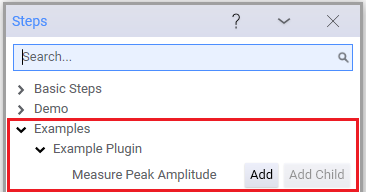
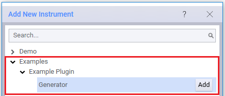
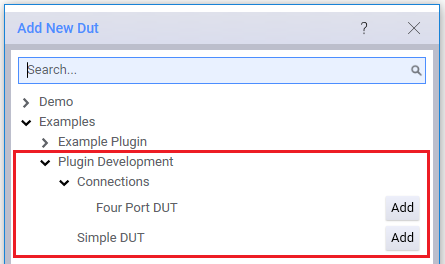
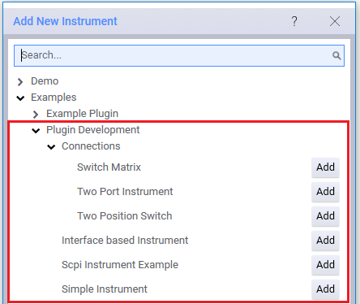
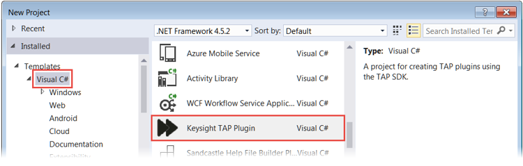
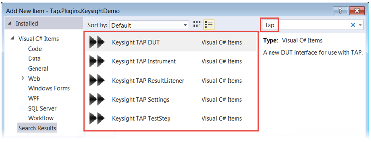

 Getting Started in Visual Studio
================================

OpenTAP plugin development begins with the **OpenTAP Plugin** template, a Visual Studio extension installed with the Keysight OpenTAP SDK. This template:

-	Contains OpenTAP plugin classes and gives you a head start to plugin development by setting up the project and providing code skeletons.
-	Copies the project's output to the location specified by the TAP_PATH environment variable, which enables OpenTAP to load the plugins during development.

## View the Visual Studio Example Projects
Before you create your own project, look at the projects and files in **`TAP_PATH\Packages\SDK\Examples`**. This folder provides code for example DUT, instrument and test step plugins. First-time TAP developers should browse and build the projects, then use the OpenTAP GUI to view the example DUTs, instruments and test steps. 

SDK Examples contains the following:

| **Folder**  | **Description** |
| -------- | --------  |
| **`ExamplePlugin\ExamplePlugin.csproj`**                           | Creates a plugin package that contains one DUT resource, one Instrument resource, and one test step.   |
|**`PluginDevelopment\PluginDevelopment.csproj`**                    | Creates a plugin package that contains several test steps, two DUT resources, four Instrument resources, and two result listeners.                                              |
|**`TestPlanExecution\BuildTestPlan.Api\BuildTestPlan.Api.csproj`**  | Shows how to build, save and execute a test plan using OpenTAP API.  |
|**`TestPlanExecution\RunTestPlan.Api\RunTestPlan.Api.csproj`**      | Shows how to load and run a test plan using OpenTAP API.   |

See the following sections:

-	[Build and View the Example Plugin Project](#build-and-view-the-example-plugin-project) provides a quick overview on how to build this plugin and see its contents.
-	[Contents of the Plugin Development Project](#contents-of-the-plugin-development-project)  shows the many resources and test steps in this project. Follow the process in the previous section to build and view the project.
-	[Create a Project with the OpenTAP Plugin Template](#create-a-project-with-the-opentap-plugin-template) describes how to get started on your own project.

### Build and View the Example Plugin Project
The Example Plugin project creates a basic plugin package that contains a test step, a DUT resource, and an instrument resource. Follow these steps to build the project and view the results in OpenTAP: 

1. In Visual Studio:

    a.   Open **ExamplePlugin.csproj**. In the Solution Explorer, notice the three .cs files. These will create an instrument resource, a DUT resource, and a test step:
    
    

    
    b.	Select Debug > Start Debugging to build the solution and open it in OpenTAP.
    
2. 	In OpenTAP:

    a.	Click the **+** icon, and add the **Measure Peak Amplitude** step:
    
    
    
    b.	View the step settings. Notice, the step requires a Generator instrument:
    
     
     
    c. In the **Resource bar**, at the bottom of the GUI, click **DUTs Add New** or if you already have DUTs configured click on one of those. This launches the **Bench Settings** window. Click the **+** button and in the **Add New Dut** window add the **Low Pass Filter** DUT, then close the window:
    
    
    
    The **Bench Settings** window can also be launched from Settings > Bench > DUT.
    
    d.	In the **Bench Settings** window, notice the **Filter** DUT lets users to specify an ID and a Comment: 
    
    
    
    e. 	In **Bench Settings**, click the **Instruments** tab, then click the + button. Add the **Generator** instrument, then close the window:
    
    
    
    f.	Notice the **Generator** instrument allows users to specify the Visa Address:
    
    
    
3. 	Close OpenTAP. Do not save any files.
4. 	If you want to remove the examples, go to your Test Automation folder and delete:
    - OpenTAP.Plugins.ExamplePlugin.dll
    - OpenTAP.Plugins.ExamplePlugin.pdb

### Contents of the Plugin Development Project

Follow the same process to build and view the **Plugin Development** project (`TAP_PATH\Packages\SDK\Examples\PluginDevelopment\PluginDevelopment.csproj`), which contains many examples:

-	Several **test step** categories that contain a number of steps:

- 	Two **DUT** resources:
 	

-	Six Instrument resources:
	

-	Two Results Listeners:
	

To remove these examples, go to your Test Automation folder and delete the **OpenTAP.Plugins.PluginDevelopment.dll** and **OpenTAP.Plugins.PluginDevelopment.pdb** files.

## Create a Project with the OpenTAP Plugin Template

The **OpenTAP Plugin Template** is a Visual Studio extension which is installed with the SDK. To start a new Visual studio project that will contain OpenTAP plugin classes:

1. 	Select **File > New > Project**. Expand the **Visual C#** templates and select the **OpenTAP Plugin** template when you create your project:

This template:

- 	Copies the project's output to the location specified by the TAP_PATH environment variable. This enables OpenTAP to load the plugins during development. Note that TAP_PATH is typically either:
    -	`C:\Program Files\Keysight\Test Automation` (64-bit systems)
    -	`C:\Program Files (x86)\Keysight\Test Automation` (32-bit systems)
-   Includes a "packaging" step (see [Plugin Packaging and Versioning](../Plugin Packaging and Versioning/Readme.md) for details).
- 	Includes a TestStep class (Step.cs). If you are not creating a test step, delete this class.

2. To create a particular plugin or add another plugin to your project:

    a.	Select **Project > Add New Item**.
    
    b.	Enter **OpenTAP** in the search field.
    
    c.	Select the appropriate plugin.
    

