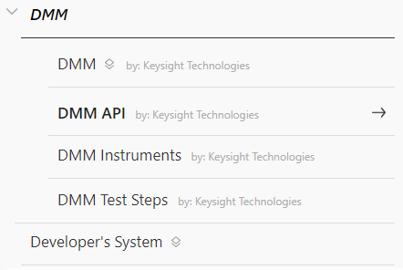

Plugin Packaging and Versioning
===============================
## Packaging
A OpenTAP Package is a file that contains plugin DLLs and supporting files. Packages are used to distribute OpenTAP plugins, while providing support for correct versioning and dependency checking. This section deals with the construction and use of OpenTAP packages. The different programs and processes involved are described below:

- The OpenTAP installation includes the **Package Manager** accessible by the `tap package` command. This can be used to create, install or uninstall packages, list installed packages, and run tests on one or more packages.
- The GUI Editor installation also includes the **PackageManager.exe** program which is a GUI for the PackageManager. It permits package downloading, displays an inventory of the packages, and ultimately installs package files found into the OpenTAP install directory.
- The default OpenTAP plugin project (release builds only) includes an *AfterBuild* task for creating a OpenTAP Package based on package declarations in the package.xml file. The resulting OpenTAP package has the **.TapPackage** suffix. Files with this suffix are renamed zip files, and as such, can be examined with a file compressor and archiver software, such as WinZip.

When run from Visual Studio, most of the processes of the packaging system are automatic and invisible to the operation. However, the developer may wish to modify the content and/or properties of the package by editing the package.xml file. The following package.xml is found in `TAP_PATH\Packages\SDK\Examples\ExamplePlugin`:

```xml
<?xml version="1.0" encoding="UTF-8"?>
<!-- 
InfoLink: Specifies a location where additional information about the package can be found.
Version: The version of the package. Must be in a semver 2.0 compatible format. This can be automatically updated from Git.

For Version the following macro is available (Only works if the project directory is under Git source control):
$(GitVersion) - Gets the version number in the recommended format Major.Minor.Build-PreRelease+CommitHash.BranchName.
-->
<Package Name="Example Plugin"
         xmlns="http://opentap.io/schemas/package"
         InfoLink="http://www.keysight.com/"
         Version="0.1.0-alpha"
         Group="Example"
         Tags="Example DUT Instrument">
  <Description>Example plugin containing Instrument, DUT and TestStep.</Description>
  <Owner>OpenTAP</Owner>
    <Files>
      <File Path="Packages/Example Plugin/OpenTap.Plugins.ExamplePlugin.dll">
        <!--SetAssemblyInfo updates assembly info according to package version.-->
        <SetAssemblyInfo Attributes="Version"/>
      </File>
      <File Path="Packages/Example Plugin/SomeSampleData.txt"/>
      <File Path="Packages/Example Plugin/Example Icon.ico">
        <PackageIcon/>
      </File>
  </Files>
</Package>
```

**Note**: A package that references an OpenTAP assembly version 9 is compatible with any OpenTAP version 9.y, but not compatible with version 8 or earlier or a future version 10. The PackageManager checks version compatibility before installing packages.  

## Packaging Configuration File
When creating a package the configuration is specified using an XML file (typically called package.xml).

The configuration file supports optional attributes:

| **Attribute** | **Description** |
| ---- | -------- |
| **InfoLink**   | Specifies a location where additional information about the package can be found. It is visible in the Package Manager as the **More Information** link.  |
| **Version**  | The version of the package. This field supports the $(GitVersion) macro. The version is displayed in the Package Manager. See [Versioning](#versioning) for more details. |
| **OS**   | Which operative systems the package is compatible with. This is a comma separated list. It is used to filter packages which are compatible with the operating system the PackageManager is running on. If the attribute is not specified, the default "Windows" is used. Example: `OS="Windows,Linux"`. Note, only the following OS values are currently supported by the package manager for automatic detection: Windows, Linux and OSX. So using one of these is recommended. |
| **Architecture**   | Used to filter packages which are compatible with a certain CPU architecture. If the attribute is not specified it is assumed that the Plugin works on all architectures. The available values are AnyCPU, x86, x64 (use for AMD64 or x86-64), arm and arm64.  |
| **Class**   | This attribute is used to classify a package. It can be set to **package**, **bundle** or **system-wide** (default value: **package**). A package of class **bundle** references a collection of OpenTAP packages, but does not contain the referenced packages. Packages in a bundle do not need to depend on each other to be referenced. For example, Keysight Developer's System is a bundle that reference the Editor (GUI), Timing Analyzer, Results Viewer, and SDK packages. <br><br> A package of class **system-wide** is installed in a global system folder so these packages can affect other installations of OpenTAP and cannot be uninstalled with the PackageManager. System-wide packages should not be OpenTAP plugins, but rather drivers and libraries.  The system folders are located differently depending on operating system and drive specifications: Windows (normally) - `C:\ProgramData\Keysight\OpenTAP`, Linux -  `/usr/share/Keysight/OpenTAP`|
| **Group** | Name of the group that this package belongs to. Groups can be nested in other groups, in which case this string will have several entries separated with '/' or '\'. May be empty. UIs may use this information to show a list of packages as a tree structure. See the example below. |
| **Tags** | A list of keywords that describe the package. Tags are separated by space or comma. |
| **LicenseRequired** | License key(s) required to use this package. During package create all `LicenseRequired` attributes from the `File` Elements will be concatenated into this property. Bundle packages (`Class` is 'bundle') can use this property to show license keys that are required by the bundle dependencies.  |

> **Note:** OpenTAP does not validate any `LicenseRequired` attributes. This attribute is only used by UIs to inform the user of a license key. The license key check should be implemented by the plugin assembly.

### Description Element
The **Description** element can be used to write a short description about the plugin. Custom elements like 'Organization' or 'Status' can be added the provide additional highlighted information. 


### Owner Element
The **Owner** element inside the configuration file is the name of the package owner. There can be multiple owners of a package, in which case this string will have several entries separated with ','. An example of this can be seen in the example below.

### SourceUrl Element
The **SourceUrl** element in the configuration file is a link to the package source code. This is intended for open sourced projects.

### File Element
The **File** element inside the configuration file supports the following attributes:

| **Attribute** | **Description** |
| ---- | -------- |
| **Path** | The path to the file. This is relative to the root the OpenTAP installation directory. This serves as both source (where the packaging tool should get the file when creating the package) and target (where the file sould be located when installed). Unless there are special requirements, the convention is to put all payload files in a Packages/\<PackageName\>/ subfolder. Wildcards are supported - see later section. |
| **SourcePath** | Optional. If present the packaging tool will get the file from this path when creating the package. |
| **LicenseRequired** | License key required by the package file. This is for information only and is not enforced by OpenTAP. The license key check should be implemented by the plugin assembly.. |

The **File** element can optionally contain custom elements supported by OpenTAP packages. In the above example it includes the `SetAssemblyInfo` element, which is supported by the OpenTAP package. When `SetAssemblyInfo` is set to `Version`, AssemblyVersion, AssemblyFileVersion and AssemblyInformationalVersion attributes of the file are set according to the package's version.

### Package Icon
A package can also include a package icon. The **File** element inside the configuration file supports adding a package icon by using the `Path` attribute to point to an image and using the `PackageIcon` element inside the `File` element. See the example above.


### Wildcards

It is possible to include multiple files using only a single **File** element using wildcards ([file globbing](https://en.wikipedia.org/wiki/Glob_(programming))). When using a wildcard in a **File** element's **Path** attribute, the element is replaced with new **File** elements representing all the files that match the pattern when the packaging tool is run. The following wildcards are supported:

| Wildcard | Description                                         | Example |  Matches             |
| -------- | --------------------------------------------------- | ------- | -------------------- |
| *        | Matches any number of any characters including none. | Law*    | Law, Laws, or Lawyer | 
| ?        | Matches any single character.                        | ?at     | Cat, cat, Bat or bat |
| **       | Matches any number of path / directory segments. When used must be the only contents of a segment. | /**/some.* | /foo/bar/bah/some.txt, /some.txt, or /foo/some.txt. |

When using wildcards in the **Path** attribute, the **SourcePath** attribute has no effect. All matching **File** elements will have all the same child elements as the original wildcard element. So this feature could be applied to the XML from the previous section as such:
```xml
...
 <Files>
    <File Path="Packages/MyPlugin/*.dll">
      <!-- SetAssemblyInfo Applied to all '.dll' files matching the wildcard. -->
      <SetAssemblyInfo Attributes="Version"/> 
    </File>
   <!-- All '.wfm' files from the directory are included. -->
   <File Path="Packages/MyPlugin/*.wfm"/> 
   <File Path="Packages/MyPlugin/Example Icon.ico">
    <!-- Only one package icon - no wildcard is used. -->
     <PackageIcon/> 
   </File>
 </Files>
 ...
 ```

### Folder Conventions

In a the package definition XML file, package authors are able to put payload files anywhere in the installation folder structure for increased flexibility. However, some conventions are defined to encurage an organized folder structure. In this context two subfolders of the OpenTAP installation folder are significant:

#### Packages Folder

The 'Packages' folder contains one folder for every package installed. The name of each of these package folders correspond to the package name. The folders contains at least the package.xml file for that package. By convention other files of the package should also be located here or in subfolders.

#### Dependencies Folder

The 'Dependencies' folder contains managed dependency assemblies (.NET DLL.) that can be shared between several packages. Each assembly has its own subfolder named with the assembly name and version. This allows several versions of the same assembly to be present. `tap package create` will automatically detect any managed assemblies referenced by the assemblies specified in the package.xml, and add them to this folder following this scheme. Files in this folder will not be searched during plugins discovery.

### Excluding Folders From Search

OpenTAP will search assemblies in the installation dir on startup for two purposes:
- Discovering OpenTAP plugins 
- Resolving dll dependencies 

Package authors can exclude sub folders from being searched by adding a marker file to the sub folder. This file must be named `.OpenTapIgnore`. The content of the file is not important (can be empty, or document why this folder should be ignored). The presence of this file will cause the folder and all subfolder to be excluded from search for both of the above purposes.

Any folder named exactly "Dependencies" will be excluded from plugin discovery only. See above section on folder conventions.

### Example

The below configuration file results in `MyPlugin.{version}.TapPackage` file,containing `OpenTap.Plugins.MyPlugin.dll`, `waveform1.wfm` and `waveform2.wfm`. `OpenTap.Plugins.MyPlugin.dll` is obfuscated but none of the waveform files are.  

```xml
<?xml version="1.0" encoding="utf-8"?>
<Package Name="MyPlugin" xmlns="http://opentap.io/schemas/package" InfoLink="http://myplugin.com"
		 Version="$(GitVersion)" OS="Windows,Linux" Architecture="x64" Group="Example" Tags="Example DUT Instrument">
  <Description>
    This is an example of an "package.xml" file.
    <Status>Released</Status>
    <Organisation>Keysight Technologies</Organisation>
    <Contacts>
      <Contact Email="tap.support@keysight.com" Name="TAP Support"/>
    </Contacts>
    <Prerequisites>None</Prerequisites>
    <Hardware>Emulated PSU</Hardware>
    <Links>
      <Link Description="Description of the MyPlugin" Name="MyPlugin" Url="http://www.keysight.com/find/TAP"/>
    </Links>
  </Description>
  <Owner>OpenTAP</Owner>
  <Files>
    <File Path="Packages/MyPlugin/OpenTAP.Plugins.MyPlugin.dll">
      <SetAssemblyInfo Attributes="Version"/>
    </File>
    <File Path="Packages/MyPlugin/waveform1.wfm"/>
    <File Path="Packages/MyPlugin/waveform2.wfm"/>
    <File Path="Packages/MyPlugin/Example Icon.ico">
      <PackageIcon/>
    </File>
  </Files>
</Package>
```

In this example the package version is set according to Git tag and branch, since `GitVersion` is expanded based on Git (described later in this section). The resulting filename would be something like `MyPlugin.9.0.103+d58122db.TapPackage`. Additionally, the `OpenTAP.Plugins.MyPlugin.dll` file would have the same version as the package, according to the `SetAssemblyInfo` element.

This `package.xml` file is preserved inside the TapPackage as metadata. The Package Manager will add some additional information to the file. The metadata file for the above configuration could look like the following:

```xml
<?xml version="1.0" encoding="utf-8" ?>
<Package Version="9.0.103+d58122db" Name="MyPlugin" InfoLink="http://myplugin.com" Date="03/14/2019 21:20:31" OS="Windows,Linux" Architecture="x64" Tags="Example DUT Instrument" xmlns="http://opentap.io/schemas/package">
  <Description>
    This is an example of an "package.xml" file.
    <Status>Released</Status>
    <Organisation>Keysight Technologies</Organisation>
    <Contacts>
      <Contact Email="tap.support@keysight.com" Name="TAP Support"/>
    </Contacts>
    <Prerequisites>None</Prerequisites>
    <Hardware>Emulated PSU</Hardware>
    <Links>
      <Link Description="Description of the MyPlugin" Name="MyPlugin" Url="http://www.keysight.com/find/TAP"/>
    </Links>
  </Description>  
  <Dependencies>
    <PackageDependency Package="OpenTAP" Version="^9.0" />
  </Dependencies>
  <Files>
    <File Path="Packages/MyPlugin/OpenTAP.Plugins.MyPlugin.dll">
      <Plugins>
        <Plugin Type="OpenTAP.Plugins.MyPlugin.Step" BaseType="Test Step"/>
        <Plugin Type="OpenTAP.Plugins.MyPlugin.MyDut" BaseType="Dut"/>
      </Plugins>
    </File>
    <File Path="Packages/MyPlugin/waveform1.wfm"/>
    <File Path="Packages/MyPlugin/waveform2.wfm"/>
    <File Path="Packages/MyPlugin/Example Icon.ico">
      <PackageIcon/>
    </File>
  </Files>
</Package>
```

The dependency and version information added by the Package Manager allows it to determine whether all prerequisites have been met when trying to install the package on the client.

If the package has dependencies on other packages it is possible to create a file with the .TapPackages extension. This is essentially a zip file that contains the created package and all the other packages it depends on. This allows the installation of all necessary packages at the same time, thus making package distribution easier.

### Example of UIs using Owner, Group and Class
Following the image below:
- The first `DMM` entry represent the group specified by the four following packages.
- The small square icons signifies the package is a bundle (class attribute).
- The gray text `by: Keysight Technologies` signifies the owner of the package.



## Command Line Use
You can create an OpenTAP package from the command line or from MSBUILD (directly in Visual Studio). If you create an OpenTAP project in Visual Studio using the SDK, the resulting project is set up to generate a .TapPackage using the Keysight.OpenTAP.Sdk.MSBuild.dll (only when building in "Release" configuration).

**tap.exe** is the OpenTAP command line tool. It can be used for different package related operations using the "package" group of subcommands. The following subcommands are supported:

| **Command** | **Description** |
| ---- | -------- |
| **tap package create** | Creates a package based on an XML description file.   |
| **tap package list** | List installed packages.   |
| **tap package uninstall** | Uninstall one or more packages.   |
| **tap package test** | Runs tests on one or more packages.   |
| **tap package download** | Downloads one or more packages.  |
| **tap package install** | Install one or more packages.  |

The following example shows how to create TAP packages based on package.xml:
```
tap.exe package create -v package.xml
```
The behavior of the `tap package create` command when packaging, can be customized using arguments. To list these arguments, from a terminal call the following:

```bash
$ tap.exe package create --help
Options:
Usage: create [-h] [-v] [-c] [--project-directory <arg>] [-o <arg>] [-p <arg>] [--fake-install] <PackageXmlFile>
  -h, --help             Write help information.
  -v, --verbose          Also show vebose/debug level messages.
  -c, --color            Color messages according to their level.
  --project-directory    The directory containing the GIT repo.
                         Used to get values for version/branch macros.
  -o, --out              Path to the output file.
  -p, --prerelease       Set type of prerelease
  --fake-install         Fake installs the created package by only extracting files not already in your installation
```

### Obfuscation
OpenTAP supports obfuscation provided by Keysight OpenTAP plugins. Two different obfuscators are supported: Preemptive Software Dotfuscator and Obfuscar v2.2.9. 

## Versioning
The OpenTAP executables and OpenTAP packages are versioned independently and should use semantic versioning (see definition [here](https://semver.org/)). Versions are of the form **X**.**Y**.**Z**-**A**+**B**, where:

- X is the major version number, incremented upon changes that **break** backwards-compatibility.
- Y is the minor version number, incremented upon backwards-compatible changes.
- Z is the patch version, incremented upon every set of code changes. The patch version can include pre-release labels.
- A is an optional pre-release label.
- B is optional metadata (e.g. Git short commit hash and/or branch name).

It is possible to set the version of the *.TapPackage using one of the following methods:*

- Git assisted versioning
- Manual versioning

### Git Assisted Versioning

The **$(GitVersion) Macro** can be used in the Version attribute of the Package and File element in package.xml. It follows semantic versioning with the **X**.**Y**.**Z**-**A**+**B** format (as described earlier). Git assisted versioning uses the Git repository history to automatically determine/increment prerelease versions. Git commits marked with annotated tags will be interpreted as **release versions**, and will not have any prerelease information added to their version numbers. Note that Git assisted versioning only recognizes annotated tags, not lightweight tags. To determine the first three values of the version number, Git assisted versioning reads a `.gitversion` file in from the root of the repository (see example later in this section). To determine the prerelease label the Git branch name is considered like this: 

- **beta**: The code is on a branch named "integration", "develop", "dev" or "master" (name configurable in `.gitversion` file). The version is marked with a "beta" pre-release identifier. A number **N** is also added denoting the commit count from the last change to the X, Y or Z parts of the version number (in the `.gitversion` file). The format of the resulting package version is X.Y.Z-**beta.N**+W, where W is set to Git short commit hash. 

- **rc**: The code is on a branch named "release" (optionally followed by a "release series" number - e.g. "release8x") (name configurable in `.gitversion` file). When there is no tag on the current commit, this is just considered a release candidate, and is marked with an "rc" pre-release identifier. A number **M** is also added denoting the commit count from when this branch was last branched out from the default branch (e.g. rc.3). The format of the resulting package version is X.Y.Z-**rc.M**+W, where W is set to Git short commit hash. 

- **alpha**: Code is on an alpha/feature branch. All branches, which do not meet the above criteria, are considered as alpha/feature branches. On these branches, an "alpha" pre-release identifier is added along with both N and M as defined above. The format of the resulting package version is X.Y.Z-**alpha.N.M**+W.**BRANCH_NAME**. For example: 1.0.0-alpha+c5317128.456-FeatureBranch, where the branch name is appended to the metadata.

To add and push annotated tag to the latest commit (and create a release version), run the following command in your project folder:

  ```sh
  git tag -a v1.0.0 -m "version 1.0.0"
  git push --tags
  ```

Annotated tags can also be created in Visual Studio. This is done by including a tag message during tag creation. A lightweight tag, which Git assisted versioning will not consider, is created if the tag message is left out.

The example above marks the latest commit with the "v1.0.0" annotated tag, i.e. a release version. When the package is created, the version (major, minor and patch) of the package is set to the value from `.gitversion`.

Example `.gitversion` file including options, their descriptions and default values:
```sh
# This file specifies the (first part of the) version number and some options used by the
# "OpenTAP sdk gitversion" command and the $(gitversion) macro in package.xml

# This is the version number that will be used. Prerelease numbers are calculated by 
# counting git commits since the last change in this value.
version = 1.0.1

# A version is determined to be a "beta" prerelease if it originates from the default branch
# The default branch is the first branch that matches the following regular expession.
# Uncomment to change the default.
#beta branch = integration

# When specified multiple times later sprcifications of "beta branch" will only be tried
# if earlier ones did not match any branches in the git repository
#beta branch = develop
#beta branch = dev
#beta branch = master

# A version is determined to be a "rc" prerelease if it originates from a branch that matches
# the following regular expression.
# Uncomment to change the default.
#release branch = release[0-9x]*

# A version is determined to be a release (no prerelease identifiers, just the version number
# specified in this file), if it originates from a commit that has an annotated tag that matches
# the following regular expression. (Note that the actual value of the tag is not used).
# Uncomment to change the default.
#release tag = v\d+\.\d+.\d+
```

To preview the version number that Git assisted versioning generates, you can use the command:

  ```sh
  tap sdk gitversion
  ```

This command can also be useful if you need the same version number elsewhere in your build script.

### Manual Versioning
The version can be set manually, e.g. `Version="1.0.2"`. The version **must** follow the semantic versioning format.

