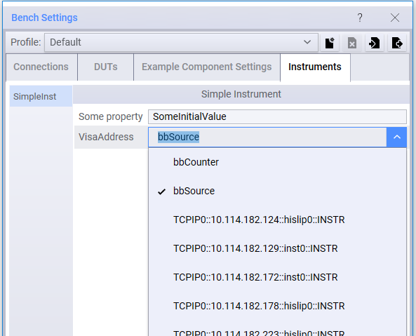

Resources
==================

## DUT

To develop a *device under test* (DUT) plugin, extend (or inherit from) the **DUT** class, which itself extends the **Resource** class. The *Open* and *Close* methods MUST be implemented:

-	The **Open** method is called before the test plan starts, and must execute successfully. The Open method should include any code necessary to configure the DUT prior to testing. All open methods on all classes that extend Resource are called in parallel, and prior to any use of the DUT in a test step.
-	The **Close** method is called after the test plan is done. The Close method should include any code necessary to configure the DUT to a safe condition after testing. The Close method will also be called if testing is halted early. All close methods are called in parallel, and after any use of the DUT in a test step. 

The DUT template generated by the Visual Studio class wizard includes minimal implementations of these calls. 

Developers should add appropriate properties and methods to the plugin code to allow:

-	Configuration of the DUT during setup. The DUT base class already has defined string properties for **ID** and **Comment**.
-	Control of the DUT during the execution of test steps. 

For examples of DUT plugin development, see:

-	`TAP_PATH\Packages\SDK\Examples\PluginDevelopment\InstrumentsAndDuts`

## Instrument

Developing an instrument plugin is done by extending either the:

-	**Instrument class** (which extends *Resource*), or 
-	**ScpiInstrument** base class (which extends *Instrument*)

It is recommended to use ScpiInstrument over the Instrument class when possible. 

Instrument plugins must implement the **Open** and **Close** methods:

-	The **Open** method is called before the test plan starts, and must execute successfully. The Open method should include any code necessary to configure the instrument prior to testing. All open methods on all classes that extend Resource are called in parallel, and prior to any use of the instrument in a test step.
-	The **Close** method is called after the test plan is done. The Close method should include any code necessary to configure the instrument to a safe condition after testing. The Close method will also be called if testing is halted early. All close methods are called in parallel, and after any use of the instrument in a test step. 

Developers should add appropriate properties to the plugin code to allow:

-	Configuration of the instrument during setup. The Instrument base class has no predefined properties. The ScpiInstrument base class has a string property that represents the **VisaAddress** (see [SCPI Instruments](#scpi-instruments) below).
-	Control of the instrument during the execution of test steps. 

Similar to DUTs, instruments must be preconfigured via the **Bench** menu choice, and tests will use the first instrument found that matches the type they need.
For instrument plugin development examples, see the files in:

-	`TAP_PATH\Packages\SDK\Examples\PluginDevelopment\InstrumentsAndDuts`

### SCPI Instruments
OpenTAP provides a number of utilities for using SCPI instruments and SCPI in general. The **ScpiInstrument** base class:

-	Has properties and methods useful for controlling SCPI based instruments
-	Includes a predefined VisaAddress property
-	Requires Open and Close logic

Important methods and properties here include:

-	**ScpiCommand**, which sends a command
-	**ScpiQuery**, which sends the query and returns the results
-	**VisaAddress**, which specifies the Visa address of the instrument
-   **ScpiQueryBlock<T>**, which sends the block query, and parses the binary block as an array of type T. All numeric types except Decimal are supported.

The SCPI *attribute* is used to identify a method or enumeration value that can be handled by the SCPI class. 

For an example, see:

-	`TAP_PATH\Packages\SDK\Examples\PluginDevelopment\TestSteps\Attributes\ScpiAttributeExample.cs`

The example below shows how the VisaAddress property for a SCPI instrument is automatically populated with values retrieved from VISA:



### Raw IO
For more exotic instruments, it may be necessary to use raw IO. For example when streaming data of indeterminate length.
To access the raw IO interface, some casting is required:

```csharp
ScpiInstrument instrument = /* ... */;
IScpiIO io = ((IScpiInstrument) instrument).IO;
```

This provides access to raw reads and writes:
-   **Read**, which reads data from the instrument into a user provided byte buffer
-   **Write**, which writes data from the user provided byte buffer to the instrument


## Resource Management

OpenTAP comes with the **ResourceOpen** attribute that is used to control how and if referenced resources are opened. This attribute is attached to a resource property and it has three modes:

-	**Resource Open Before** - This mode indicates that the resources pointed to by this property will be opened in sequence, so any referenced resources are open before `Open()` and until after `Close()`. This is the default behavior.
-	**Resource Open Parallel** - This mode indicates that a resource property on a resource can be opened in parallel with the resource itself.
-	**Resource Open Ignore** - This mode indicates that a resource referenced by this property will not be opened or closed.

For an examples of Resource Management, see:

-	`TAP_PATH\Packages\SDK\Examples\PluginDevelopment\TestSteps\Attributes\ResourceOpenAttributeExample`

Both examples have a base instrument that depends on a sub instrument , each having its own respective `resource open` attribute.

### Resource Open
Upon running *ResourceOpenBeforeAttributeExample* test step in a test plan, the sub instrument will invoke its `Open()` method first, before the base instrument's `Open()` method. A delay is added to demonstrate the connection status of sub instrument connecting first.

When the test plan stops, the base instrument's `Close()` method will be invoked and disconnected. A delay is added to demonstrate that the sub instrument will invoke its `Close()` method after the base instrument has been disconnected.

### Resource Parallel
Upon running *ResourceOpenParallelAttributeExample* test step in a test plan, the base instrument will open in parallel with the sub instrument. To demonstrate that the sub instrument is being invoked to open, a delay is added to delay the opening of the connection of the base instrument.

When the test plan stops, the sub instrument will disconnect and close its connection in parallel with the base instrument. Subsequently, a delay is added to demonstrate that the base instrument is being disconnected.

### Resource Ignore
Resources with the `resource ignore` attribute are ignored by the test plan during execution. Hence, these resources will not invoke their `Open()` nor their `Close()` methods.

### Resource Strategy
There is a setting that can affect the open and close sequence of resources. Under **Engine settings**, change resource strategy from **Default Resource Manager** to **Short Lived Connections**.

```

`09:14:45.593  TestPlan     -----------------------------------------------------------------`
`09:14:45.594  TestPlan     Starting TestPlan 'Untitled' on 10/13/2020 09:14:45, 1 of 1 TestSteps enabled.`
`09:14:45.606  TwoPortInst  Opening TwoPortInstrument.`
`09:14:45.606  TwoPortInst  Resource "TwoPortInst" opened. [65.4 us]`
`09:14:47.606  INST         Opening Prior Instrument`
`09:14:47.606  INST         PriorSubInstr connected: True`
`09:14:47.606  INST         IgnoreSubInstr connected: False`
`09:14:47.606  INST         Resource "INST" opened. [2.00 s]`
`09:14:47.606  TestPlan     "Resource Open Before Example" started.`
`09:14:48.607  INST         Closing Prior Instrument`
`09:14:50.607  INST         PriorSubInstr connected: True`
`09:14:50.607  INST         IgnoreSubInstr connected: False`
`09:14:50.607  INST         Resource "INST" closed. [3.00 s]`
`09:14:50.607  TwoPortInst  Closing TwoPortInstrument.`
`09:14:50.607  TwoPortInst  Resource "TwoPortInst" closed. [50.1 us]`
`09:14:50.607  TestPlan     "Resource Open Before Example" completed. [5.00 s]`
`09:14:50.613  Summary      ----- Summary of test plan started 10/13/2020 09:14:45 -----`
`09:14:50.613  Summary       Resource Open Before Example                     5.00 s`         
`09:14:50.613  Summary      ------------------------------------------------------------`
`09:14:50.613  Summary      -------- Test plan completed successfully in 5.01 s --------`

```

The above log demonstrates that **Short Lived Connections** always close before the test plan execution ends. However, using the **Default Resource Manager**, the resource connections will be closed only after the test plan execution has ended.
Using short lived connections result in more efficient resource management since connections are closed when no longer needed by the test plan.
