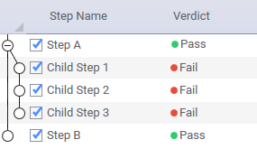

Test Step
=========

A test step plugin is developed by extending the **TestStep** base class. As you develop test steps, Keysight recommends the following:

-	Isolate each test step into a single .cs file, with a name similar to the display name. This makes the code easy to find, and focused on a single topic. 
-	Use **TapThread.Sleep()** for sleep statements. This makes it possible for the user to abort the test plan during the sleep state.

## Default Implementation

The default implementation of a TestStep (as generated when using the Visual Studio Item Template for TestSteps) includes:

-	A region for **Settings**, which are configurable inputs displayed in **Step Settings** panel. While initially empty, most test steps require the user to specify settings, which are very likely referenced in the Run method.
-	A **PrePlanRun** method that may be overridden. The PrePlanRun method:
    -	Is called *after* any required resources have been opened and *prior* to any calls to TestStep.Run. (It is NOT called immediately before the test step runs.) 
    -	Should perform setup that is required for each test plan run, such as configuring resources that are needed for test plan execution. 
    
    PrePlanRun methods are called sequentially in a flattened, top-to-bottom order of the steps placement in the test plan.
-	A **Run** method that must be included. In the absence of any flow control statements, the required Run method is called in the order of the placement of test steps in the test plan. The Run method:
    -	Implements the primary functionality of the test step. 
    -	Typically leverages the test step's settings. 
    -	Often includes logic to control the DUTs and instruments, determine verdicts, publish results, log messages, etc. Separate sections deal with many of these topics. 
-	A **PostPlanRun** method that may be overridden. PostPlanRun methods are called sequentially in a flattened, bottom-to-top order of their placement in the test plan (the reverse of the PrePlanRun order.) The PostPlanRun method:
    -	Is used for "one-time" cleanup or shutdown.
    -	Is called after the test plan has completed execution, and *prior* to any calls to close the resources used in the test. (It is NOT called immediately after the test step runs). 
    -	Is always called if PrePlanRun for the test step was called (also in case of errors/abort). This method can be used to clean up PrePlanRun actions. 

The following code shows the template for a test step:

```csharp
namespace MyOpenTAPProject
{
    [Display("MyTestStep1", Group: "MyPlugin2", Description: "Insert a description here")]
    public class MyTestStep1 : TestStep
    {
        #region Settings
        // ToDo: Add property here for each parameter the end user is able to change
        #endregion
        public MyTestStep1()
        {
            // ToDo: Set default values for properties / settings.
        }

        public override void PrePlanRun()
        {
            base.PrePlanRun();
            // ToDo: Optionally add any setup code this step must run before testplan start.
        }

        public override void Run()
        {
            // ToDo: Add test case code here.
            RunChildSteps(); //If step has child steps.
            UpgradeVerdict(Verdict.Pass);
        }

        public override void PostPlanRun()
        {
            // ToDo: Optionally add any cleanup code this step needs to run after the 
            // entire testplan has finished.
            base.PostPlanRun();
        }
    }
}
```
To allow user configuration of a test step, developers must add appropriate properties to the plugin code. These properties will very likely be visible and editable in the OpenTAP GUI. Properties typically include instrument and DUT references, instrument and DUT settings, timing and limit information, etc. Defining these properties is a major part of plugin development.

The SDK provides many examples of test step development in the **`TAP_PATH\Packages\SDK\Examples\PluginDevelopment\TestSteps`** folder. 

## TestStep Hierarchy

Each TestStep object contains a list of TestSteps called *Child Steps*. A hierarchy of test steps can be built with an endless number of levels. The child steps:

-	Are run in sequence by calling the **RunChildSteps** method from the parent step's Run method. 
-	Can also be run individually using the **RunChildStep** method to get even more fine-grained control. This is an advanced topic. Running child steps should only be done when the control flow is inside the parent step's Run method.

### Defining Relationships

Parent/Child relationships are defined by attributes associated with the Test Step class definition:

-	From a *Parent* perspective, the **AllowAnyChild** and **AllowChildrenOfType** attributes define the parent/child relationship. 
-	From a *Child* perspective, the **AllowAsChildIn** attribute defines the parent/child relationship.
	

If multiple attributes apply (such as AllowChildrenOf Type and AllowAsChildIn), then both must evaluate to **true** for the GUI to allow a child to be inserted under a parent.

It is common practice for a child to use properties from a parent. For example, a child might need to reference a DUT or instrument defined in a parent. The **GetParent** method allows a child to search for a parent of a particular type, and retrieve a setting. For example:

```csharp
public override void PrePlanRun()
{
    base.PrePlanRun(); 

    // Find parents of a certain type, and get a resource reference from them.
    // Resources include things like Instruments and DUTs.
    _parentsDut = GetParent<ParentWithResources>().SomeDut;
    _parentsInstrument = GetParent<ParentWithResources>().SomeInstrument;
}
```

It is valuable to use *interfaces* instead of *types* in the AllowChildrenOfType and AllowAsChildIn attributes. This more general approach allows any test step child that implements the appropriate interface. For example:

```csharp
[Display(Groups: new[] { "Examples", "Feature Library", "ParentChild" }, Name: "Child Only Parents With InterfaceB", Description: "Only allowed in parents with interface B")]
// This will only allow children that implement this interface.
[AllowAsChildIn(typeof(IInterfaceB))]
public class ChildOnlyParentsWithInterfaceB : TestStep {

}
```

It is possible to programmatically assign children in the parent's constructor, as shown below:

```csharp
public ExampleParentTestStep()
{
    Name = "Parent Step";
    ChildTestSteps.Add(new ExampleChildTestStep { Name = "Child Step 1"});
    ChildTestSteps.Add(new ExampleChildTestStep { Name = "Child Step 2" });
}
```
For examples of parent/child implementations, see: **`TAP_PATH\Packages\SDK\Examples\PluginDevelopment\TestSteps\ParentChild`**.

## Verdict
OpenTAP allows steps to be structured in parent/child hierarchy. The OpenTap.Verdict enumeration defines a 'verdict' indicating the state and progress of each test step and test plan run. The following table shows the available values for OpenTap.Verdict, in increasing order of severity. 

| **Verdict Severity** (lowest to highest) | **Description** |
| ---- | -------- |
| **NotSet**    | No verdict was set (the initial value)   |
| **Pass**   | Step or plan passed   |
| **Inconclusive**   | More information is needed to make a verdict or the results were close to the limits  |
| **Fail**   | Results fail the limits   |
| **Aborted**   | Test plan is aborted by the user   |
| **Error**  | An error occurred; this could be instrument, DUT, software errors, etc.   |

Each TestStep has its own verdict property. The verdict can be set using the UpgradeVerdict function as shown below (from SetVerdicts.cs):

```csharp
[Display("Set Verdict", Groups: new[] { "Examples", "Plugin Development", "Step Execution" }, Description: "Shows how verdict of step is set using UpgradeVerdict")]
public class SetVerdict : TestStep
{
    #region Settings
        
    public Verdict MyVerdict { get; set; }
    public double LowerLimit { get; set; }
    public double UpperLimit { get; set; }
    #endregion

    public SetVerdict()
    {
        MyVerdict = Verdict.NotSet;
        LowerLimit = 0;
        UpperLimit = 5;
    }

    public override void Run()
    {
        UpgradeVerdict(MyVerdict);
         
        var result = 2.5;
        if (result > LowerLimit && result < UpperLimit)
        {
            UpgradeVerdict(Verdict.Pass);
        }
        else UpgradeVerdict(Verdict.Fail);

    }
}
```

If possible, a test step changes its verdict (often from **NotSet** to one of the other values) during execution. The test step verdict is set to the most severe verdict of its direct child steps and it is not affected by child steps further down the hierarchy. In the example below, you can see the default behavior, according to which the parent step reflects the most severe verdict of its children.


The verdict of Step A and Step B affect the test plan verdict. The verdict of Step A is based on the most severe verdict of its child steps. Since *Child Step 2* failed, the verdict of Step A is also *Fail* even though the other two child steps passed. Therefore, the verdict of Step A, and thus the verdict of the test plan, is also fail.

This behavior is expected if the child steps are executed by calling the RunChildSteps/RunChildStep methods. In the case when a different verdict is desired than the one from the child steps, there is a possibility to override the verdict in the parent step. This is useful in cases, where, for example, a recovering strategy like DUT/instrument reboot is handled.



In the example above Step A is implemented so, that it sets its verdict based on different criteria and not based on the verdict of its child steps.

## Log Messages

Log messages provide useful insight to the process of writing and debugging the test step code (as well as other plugin code). The TestStep base class has a predefined Log source, called **Log**. Log messages are displayed in the OpenTAP GUI **Log** panel and saved in the log file.

When creating log messages, Keysight recommends the following:

-	Ensure that your logged messages are using the correct log levels. Make use of debug level for less relevant messages.
-	Ensure that time-consuming operations write a descriptive message to the log that includes *duration* (to ensure that the operation will be clearly visible in the Timing Analyzer.)

**Note**: Logs are NOT typically used for RESULTS, which are covered in a different section.

Four levels of log messages - **Error**, **Warning**, **Information**, and **Debug** - allow the messages to be grouped in order of importance and usefulness. Log messages are shown in the GUI and CLI and are stored in the sessions log file, named `SessionLogs\SessionLog [DateTime].txt` (debug messages are enabled by the *verbose* command line argument).

By default, log messages for each:

-	*Run* are stored in `TAP_PATH\Results` (configurable in the Results settings).
-	*Session* are stored in `TAP_PATH\SessionLogs` (configurable in the Engine settings).

Log messages for each run are also available to the ResultListener plugins, as the second parameter on the ResultListeners' OnTestPlanRunCompleted method which looks like it's shown below:

```csharp
void OnTestPlanRunCompleted(TestPlanRun planRun, System.IO.Stream logStream);
```
**Note**: Users can create their own logs by creating an instance of **TraceSource** as shown in the code below. The *name* used to create the source is shown in the log:
```csharp
Log.Debug("Info from Run");
private TraceSource MyLog = OpenTAP.Log.CreateSource("MyLog");
MyLog.Info("Info from Run");
```
### Timestamps and Timing Analysis
The log file contains a timestamp for all entries. This time reflects the time at which the logging method was called. Additionally, it is possible to log time spans/durations of specific actions, such as the time it takes to measure, set up, or send a group of commands.

To log duration, overloads of the `Debug()`, `Info()`, `Warning()` and `Error()` methods are provided. These accept a `TimeSpan` or a `Stopwatch` instance as the first parameter, as shown in the following code:
```csharp
// The Log can accept a Stopwatch Object to be used for timing analysis
Stopwatch sw1 = Stopwatch.StartNew();
TapThread.Sleep(100);
Log.Info(sw1, "Info from Run");

Stopwatch sw2 = Stopwatch.StartNew();
TapThread.Sleep(200);
Log.Error(sw2, "Error from step");
```
This will result in a log message containing the event text and a time duration tag enclosed in square brackets. 
```
12:27:32.883 MyLog     Info from Run [ 100 ms ]
12:27:33.083 MyLog     Error from step [ 201 ms ]
```
The time duration tags make it possible to do more advanced post timing analysis. The Timing Analyzer tool visualizes the timing of all log messages with time stamps. 

### Exception Logging
Errors are generally expressed as exceptions. Exceptions thrown during test step execution prevents the step from finishing. If an exception is thrown in a test step run method, it will abort the execution of the test step. The exception will be caught by the TestPlan and it will gracefully stop the plan, unless configured continue in the Engine Settings.

A step can abort the test plan run by calling `PlanRun.MainThread.Abort();`, but it is generally best to let the user decide whether to stop on errors or not.

A message is written to the log when a step throws an exception. The log message contains information on source file and line number if debugging symbols (.pdb files) are available and **Settings > GUI > Show Source Code Links** is enabled.

If an unexpected exception is caught by plugin code its stacktrace can be logged by calling `Log.Debug(exception)` to provide useful debugging information. The exception message should generally be logged using `Log.Error`, to show the user that something has gone wrong.

### TraceBar
The **TraceBar** is a utility class used to display log results and verdicts in the **Log** panel. If an upper and lower limit is available, the TraceBar visually displays the one-dimensional high-low limit sets in a log-friendly graphic:


Additionally, it handles the verdict of the results. If all the limits passed, the TraceBar.CombinedVerdict is *Pass*; otherwise it is *Fail*. If the result passed to TraceBar is NaN, the verdict will upgrade to Inconclusive. For an example see the code sample in LogMessages.cs file.

## Validation
Developers customize validation by adding one or more *Rules* to the constructor of their object. A rule has three parameters:

-	A delegate to a function that contains the validation logic (may be an anonymous function or a lambda expression)
-	The message shown to the user when validation fails
-   The list of properties to which this rule applies

See an example of the use of validation in RuleValidation.cs, as shown below:
```csharp
[Display("RuleValidation Example", Groups: new[] { "Examples", "Feature Library", " Commonly Used" }, Description: "An example of how Validation works.")]
// Also works for instruments, result listeners, DUTs...., since they all extend 
// ValidatingObject
public class RuleValidation : TestStep 
{
    #region Settings

    [Display("Should Be True Property", Description: "Value should be true to pass validation.")]
    public bool ShouldBeTrueProp { get; set; }

    public int MyInt1 { get; set; }
    public int MyInt2 { get; set; }

    #endregion

    public RuleValidation()
    {
        // Validation occurs during the constructor.
        // When using the GUI, validation will occur upon editing. When using the engine
        // without the GUI, validation occurs upon loading the test plan.

        // Calls a function that returns a boolean
        Rules.Add(CheckShouldBeTrueFunc, "Must be true to run", "ShouldBeTrueProp");

        // Calls an anonymous function that returns a boolean
        Rules.Add(() => MyInt1 + MyInt2 == 6, "MyInt1 + MyInt2 must == 6", "MyInt1", "MyInt2");

        //Ensure all rules fail.
        ShouldBeTrueProp = false;
        MyInt1 = 2;
        MyInt2 = 2;
    }

    private bool CheckShouldBeTrueFunc()
    {
        return ShouldBeTrueProp;
    }
}
```
The setting as displayed in the GUI looks like this:


## Publishing Results 
Publishing results from a test step is a fundamental part of test step execution. The following section discusses publishing results in detail. At a high level, publishing results usually involves a single call, as shown in the following code snippet from `TAP_PATH\Packages\SDK\Examples\ExamplePlugin\MeasurePeakAmplituteTestStep.cs`.
```csharp
InputData = new double[] {0, 0, 5, 5, 5, 50};
ReadOnlyOutputData = new double[]{10, 10, 15, 15, 15, 150};
Results.PublishTable("Inputs vs. Moving Average", new List<string>() {"Input Values", "Output Values"}, 
     InputData, ReadOnlyOutputData);
```
### Basic Theory
Test step results are represented in a ResultTable object. A ResultTable consists of a name, one to N columns, and one to M rows. Each test step typically publishes one uniquely named table. Less frequently (but possible), a test step will publish N tables, with different names, row/column definitions and values. The ResultTable is passed to each of the configured ResultListeners for individual handling.

### ResultTable Details
This graphic shows the ResultTable definition.


### ResultSource Object
A ResultSource object (named Results in the test step base class) and its publish methods push result tables to the configured ResultListeners.

There are three major considerations for publishing results:

-	What is the "shape" of your results? Is it a single name/value pair, a single "row" or a set of name/value pairs of data and N rows? 
-	How fast do you want to store the results?
-	What table and column names do you wish to use?

The following **ResultSource.Publish** methods are available:

| **Method Name** | **General Use** | **Scope** |
| -------- | -------- | ---- |
| `Publish<T>(T result)`   | For a type T, publishes all the public scalar properties as a single row with N columns. The names of the properties become the column names. The values become the row values. The table name will be the name of the type T, unless overridden by the Display attribute.| Single Row   |
|` Publish<T>(string name,  T result)` | Similar to the previous method, but assigns a unique name to the table name.  | Single Row  |
| `Publish(string name, List<string> columnNames, params IConvertible[] results)`  | Publishes a row of data with N column names, and N values. The number of columnNames must match the size of the Results array.   | Single Row   |
| `PublishTable(string name, List<string> columnNames, params Array[] results)`   | Publishes N columns of data, each with M rows. The columnNames parameter defines the ResultTable.ColumnNames property. The results parameter (an array), with N columns, and M rows, is used to populate the N ResultColumn objects, each with an array of data. The size of the columnNames property must match the results array column count. PublishTable: Can be called repeatedly to fill up a table;	Is the **fastest** way to store data and should be used when results are large| N Rows  |


For different approaches to publishing results, see the examples in:

-	`TAP_PATH\Packages\SDK\Examples\PluginDevelopment\TestSteps\PublishResults`

	
## Serialization
Default values of properties should be defined in the constructor. Upon saving a test plan, the test plan's **OpenTAP.Serializer** adds each step's public property to the test plan's XML file. Upon loading a test plan from a file, the OpenTAP.Serializer first instantiates the class with values from the constructor and then fills the property values from the values found in the test plan file. 

Because the resource references are declared as properties:

-	Their value can be saved and loaded from XML files
-	The GUI will support setting the references in a user-friendly way

This convention applies for many different types.

## Inputs and Outputs
Inputs and outputs are test step settings that transfer data between test steps during a test plan run. This is useful in situations where one step depends on a result from another step, but could also be used for flow control. 

For examples, see:

-	 `TAP_PATH\Packages\SDK\Examples\PluginDevelopment\TestSteps\InputOutput`

The generic **Input** class takes one type argument. The Input property references an *Output* of a different step. If no Output is assigned to the Input, the value of the Input is null, and will result in an error.

The **Output** attribute indicates a property that is an output variable. Outputs can be connected to Inputs. Every step has a Verdict property, which is automatically an output property. The Verdict output can be connected to the *If* step, which has an `Input<Verdict>` property. 

The following code (from GenerateOutput.cs) shows how to generate **Output** properties. 
```csharp
[Output]
[Display("Output Value")]
public double OutputValue { get; private set; }
```
The following code (from HandleInput.cs) shows how to use Input properties. You should use the InputValue.**Value** to access the value contained in the input variable. See the red box below:
```csharp
[Display("Handle Input", Groups: new[] { "Examples", "Feature Library", "InputOutput" }, 
    Description: "Handles a double input value.")]
public class HandleInput : TestStep
{
    #region Settings
    [Display("Input Value")]
    // Properties defined using the Input generic class will accept values 
    // from other (typically prior) test steps with properties that have been 
    // marked with the Output attribute.
    public Input<double> InputValue { get; set; }      
    #endregion

    public HandleInput()
    {
        InputValue = new Input<double>();
    }

    public override void Run()
    {
        if (InputValue == null) throw new ArgumentException();

        Log.Info("Input Value: " + InputValue.Value);
        UpgradeVerdict(Verdict.Pass);
    }
}
```
## Exceptions 
Exceptions from user code are caught by OpenTAP. This could break the control flow, but all resources will always be closed. If the exception gets caught before PostPlanRun, the steps that had PrePlanRun called will also get PostPlanRun called. When a step fails (by setting the Verdict to *Fail* or *Abort*) or throws an exception, execution can be configured to continue (ignoring the error) or to abort execution. These settings are configured in Engine settings, by configuring the "Abort Run If" property.
