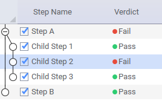
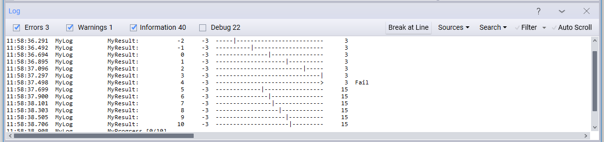
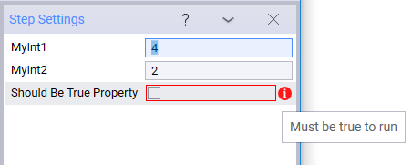
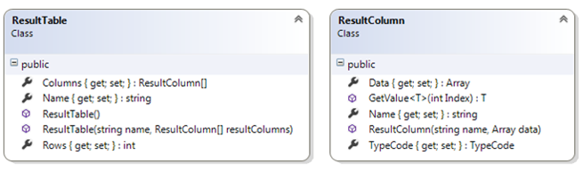
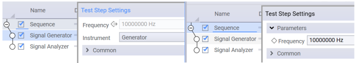
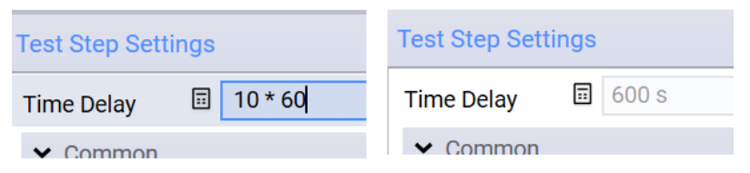

Test Step
=========

A test step plugin is developed by extending the **TestStep** base class. As you develop test steps, the following is recommended:

-	Isolate each test step into a single .cs file, with a name similar to the display name. This makes the code easy to find, and focused on a single topic. 
-	Use **TapThread.Sleep()** for sleep statements. This makes it possible for the user to abort the test plan during the sleep state.

## Default Implementation

The default implementation of a TestStep (as generated when using the Visual Studio Item Template for TestSteps) includes:

-	A region for **Settings**, which are configurable inputs displayed in **Step Settings** panel. While initially empty, most test steps require the user to specify settings, which are very likely referenced in the Run method.
-	A **PrePlanRun** method that may be overridden. The PrePlanRun method:
    -	Is called *after* any required resources have been opened and *prior* to any calls to TestStep.Run. (It is NOT called immediately before the test step runs.) 
    -	Should perform setup that is required for each test plan run, such as configuring resources that are needed for test plan execution. 
    
    PrePlanRun methods are called sequentially in a flattened, top-to-bottom order of the steps placement in the test plan.
-	A **Run** method that must be included. In the absence of any flow control statements, the required Run method is called in the order of the placement of test steps in the test plan. The Run method:
    -	Implements the primary functionality of the test step. 
    -	Typically leverages the test step's settings. 
    -	Often includes logic to control the DUTs and instruments, determine verdicts, publish results, log messages, etc. Separate sections deal with many of these topics. 
-	A **PostPlanRun** method that may be overridden. PostPlanRun methods are called sequentially in a flattened, bottom-to-top order of their placement in the test plan (the reverse of the PrePlanRun order.) The PostPlanRun method:
    -	Is used for "one-time" cleanup or shutdown.
    -	Is called after the test plan has completed execution, and *prior* to any calls to close the resources used in the test. (It is NOT called immediately after the test step runs). 
    -	Is always called if PrePlanRun for the test step was called (also in case of errors/abort). This method can be used to clean up PrePlanRun actions. 

The following code shows the template for a test step:

```csharp
namespace MyOpenTAPProject
{
    [Display("MyTestStep1", Group: "MyPlugin2", Description: "Insert a description here")]
    public class MyTestStep1 : TestStep
    {
        #region Settings
        // ToDo: Add property here for each parameter the end user is able to change
        #endregion
        public MyTestStep1()
        {
            // ToDo: Set default values for properties / settings.
        }

        public override void PrePlanRun()
        {
            base.PrePlanRun();
            // ToDo: Optionally add any setup code this step must run before testplan start.
        }

        public override void Run()
        {
            // ToDo: Add test case code here.
            RunChildSteps(); // If step has child steps, run them.
            UpgradeVerdict(Verdict.Pass);
        }

        public override void PostPlanRun()
        {
            // ToDo: Optionally add any cleanup code this step needs to run after the 
            // entire testplan has finished.
            base.PostPlanRun();
        }
    }
}
```

## Test Step Hierarchy

Each TestStep object contains a list of TestSteps called *Child Steps*. A hierarchy of test steps can be built with an endless number of levels. The child steps:

-	Are run in sequence by calling the **RunChildSteps** method from the parent step's Run method. 
-	Can also be run individually using the **RunChildStep** method to get even more fine-grained control. This is an advanced topic. Running child steps should only be done when the control flow is inside the parent step's Run method.

### Defining Relationships

Parent/Child relationships are defined by attributes associated with the Test Step class definition:

-	From a *Parent* perspective, the **AllowAnyChild** and **AllowChildrenOfType** attributes define the parent/child relationship. 
-	From a *Child* perspective, the **AllowAsChildIn** attribute defines the parent/child relationship.
	

If multiple attributes apply (such as AllowChildrenOf Type and AllowAsChildIn), then both must evaluate to **true** for the GUI to allow a child to be inserted under a parent.

It is common practice for a child to use properties from a parent. For example, a child might need to reference a DUT or instrument defined in a parent. The **GetParent** method allows a child to search for a parent of a particular type, and retrieve a setting. For example:

```csharp
public override void PrePlanRun()
{
    base.PrePlanRun(); 

    // Find parents of a certain type, and get a resource reference from them.
    // Resources include things like Instruments and DUTs.
    _parentsDut = GetParent<ParentWithResources>().SomeDut;
    _parentsInstrument = GetParent<ParentWithResources>().SomeInstrument;
}
```

It is valuable to use *interfaces* instead of *types* in the AllowChildrenOfType and AllowAsChildIn attributes. This more general approach allows any test step child that implements the appropriate interface. For example:

```csharp
[Display(Groups: new[] { "Examples", "Feature Library", "ParentChild" }, Name: "Child Only Parents With InterfaceB", Description: "Only allowed in parents with interface B")]
// This will only allow children that implement this interface.
[AllowAsChildIn(typeof(IInterfaceB))]
public class ChildOnlyParentsWithInterfaceB : TestStep {

}
```

It is possible to programmatically assign children in the parent's constructor, as shown below:

```csharp
public ExampleParentTestStep()
{
    Name = "Parent Step";
    ChildTestSteps.Add(new ExampleChildTestStep { Name = "Child Step 1" });
    ChildTestSteps.Add(new ExampleChildTestStep { Name = "Child Step 2" });
}
```
For examples of parent/child implementations, see: **`TAP_PATH\Packages\SDK\Examples\PluginDevelopment\TestSteps\ParentChild`**.

## Verdict
OpenTAP allows steps to be structured in parent/child hierarchy. The OpenTap.Verdict enumeration defines a 'verdict' indicating the state and progress of each test step and test plan run. The following table shows the available values for OpenTap.Verdict in increasing order of severity. 

| **Verdict Severity** (lowest to highest) | **Description** |
| ---- | -------- |
| **NotSet**    | No verdict was set (the initial value)   |
| **Pass**   | Step or plan passed   |
| **Inconclusive**   | More information is needed to make a verdict or the results were close to the limits  |
| **Fail**   | Results fail the limits   |
| **Aborted**   | Test plan is aborted by the user   |
| **Error**  | An error occurred; this could be instrument, DUT, software errors, etc.   |

Each TestStep has its own verdict property. The verdict can be set using the UpgradeVerdict function as shown below (from SetVerdicts.cs):

```csharp
[Display("Set Verdict", Groups: new[] { "Examples", "Plugin Development", "Step Execution" }, Description: "Shows how the verdict of a step is set using UpgradeVerdict")]
public class SetVerdict : TestStep
{
    #region Settings
        
    public Verdict MyVerdict { get; set; }
    public double LowerLimit { get; set; }
    public double UpperLimit { get; set; }
    #endregion

    public SetVerdict()
    {
        MyVerdict = Verdict.NotSet;
        LowerLimit = 0;
        UpperLimit = 5;
    }

    public override void Run()
    {
        UpgradeVerdict(MyVerdict);
         
        var result = 2.5;
        if (result > LowerLimit && result < UpperLimit)
        {
            UpgradeVerdict(Verdict.Pass);
        }
        else UpgradeVerdict(Verdict.Fail);

    }
}
```

If possible, a test step changes its verdict (often from **NotSet** to one of the other values) during execution. The test step verdict is set to the most severe verdict of its direct child steps, and it is not affected by child steps further down the hierarchy. In the example below, you can see the default behavior, according to which the parent step reflects the most severe verdict of its children.



The verdict of Step A and Step B affect the test plan verdict. The verdict of Step A is based on the most severe verdict of its child steps. Since *Child Step 2* failed, the verdict of Step A is also *Fail* even though the other two child steps passed. Therefore, the verdict of Step A, and thus the verdict of the test plan, is also fail.

This behavior is expected if the child steps are executed by calling the RunChildSteps/RunChildStep methods. In the case when a different verdict is desired than the one from the child steps, there is a possibility to override the verdict in the parent step. This is useful in cases, where, for example, a recovering strategy like DUT/instrument reboot is handled.


In the example above, Step A is implemented such that it sets its verdict based on different criteria from the verdict of its child steps.

## Log Messages

Log messages provide useful insight to the process of writing and debugging the test step code (as well as other plugin code). The TestStep base class has a predefined Log source, called **Log**. Log messages are displayed in the GUI Editor **Log** panel and saved in the log file.

When creating log messages, the following is recommended:

-	Ensure that your logged messages are using the correct log levels. Make use of debug level for less relevant messages.
-	Ensure that time-consuming operations write a descriptive message to the log that includes *duration* (to ensure that the operation will be clearly visible in the Timing Analyzer.)

**Note**: Logs are NOT typically used for RESULTS, which are covered in a different section.

Four levels of log messages — **Error**, **Warning**, **Information**, and **Debug** — allow messages to be grouped in order of importance and relevance. Log messages are shown in the GUI and CLI, and are stored in the session's log file, named `SessionLogs\SessionLog [DateTime].txt` (debug messages are enabled by the *--verbose* command line argument).

By default, log messages for each:

-	*Run* are stored in `TAP_PATH\Results` (configurable in the Results settings).
-	*Session* are stored in `TAP_PATH\SessionLogs` (configurable in the Engine settings).

Log messages for each run are also available to the ResultListener plugins, as the second parameter on the ResultListeners' OnTestPlanRunCompleted method which looks like it's shown below:

```csharp
void OnTestPlanRunCompleted(TestPlanRun planRun, System.IO.Stream logStream);
```
**Note**: Users can create their own logs by creating an instance of **TraceSource** as shown in the code below. The *name* used to create the source is shown in the log:
```csharp
Log.Debug("Info from Run");
private TraceSource MyLog = OpenTAP.Log.CreateSource("MyLog");
MyLog.Info("Info from Run");
```
### Timestamps and Timing Analysis
The log file contains a timestamp for all entries. This time reflects the time at which the logging method was called. Additionally, it is possible to log time spans/durations of specific actions, such as the time it takes to measure, set up, or send a group of commands.

To log duration, overloads of the `Debug()`, `Info()`, `Warning()` and `Error()` methods are provided. These accept a `TimeSpan` or a `Stopwatch` instance as the first parameter, as shown in the following code:
```csharp
// The Log can accept a Stopwatch Object to be used for timing analysis
Stopwatch sw1 = Stopwatch.StartNew();
TapThread.Sleep(100);
Log.Info(sw1, "Info from Run");

Stopwatch sw2 = Stopwatch.StartNew();
TapThread.Sleep(200);
Log.Error(sw2, "Error from step");
```
This will result in a log message containing the event text and a time duration tag enclosed in square brackets. 
```
12:27:32.883 MyLog     Info from Run [ 100 ms ]
12:27:33.083 MyLog     Error from step [ 201 ms ]
```
The time duration tags make it possible to do more advanced post timing analysis. The Timing Analyzer tool visualizes the timing of all log messages with time stamps. 

### Exception Logging
Errors are generally expressed as exceptions. Exceptions thrown during test step execution prevent the step from finishing. If an exception is thrown in a test step run method, it will abort the execution of the test step. The exception will be caught by the TestPlan and it will gracefully stop the plan, unless configured to continue in the Engine Settings.

A step can abort the test plan run by calling the `PlanRun.MainThread.Abort()` method. If you have multiple steps in a plan, the engine will check if abort is requested between the `Run()` methods of successive steps. If you have a step which takes a long time to execute, you can call the `OpenTap.TapThread.ThrowIfAborted()` method to check if abort is requested during the execution of the step.

A message is written to the log when a step throws an exception. The log message contains information on source file and line number if debugging symbols (.pdb files) are available, and **Settings > GUI > Show Source Code Links** is enabled.

If an unexpected exception is caught by plugin code, its stacktrace can be logged by calling `Log.Debug(exception)` to provide useful debugging information. The exception message should generally be logged using `Log.Error`, to show the user that something has gone wrong.

### TraceBar
The **TraceBar** is a utility class used to display log results and verdicts in the **Log** panel. If an upper and lower limit is available, the TraceBar visually displays the one-dimensional high-low limit sets in a log-friendly graphic:



Additionally, it handles the verdict of the results. If all the limits passed, the TraceBar.CombinedVerdict is *Pass*; otherwise it is *Fail*. If the result passed to TraceBar is NaN, the verdict will upgrade to Inconclusive. For an example, see the code sample in LogMessages.cs.

## Validation
Validation is customized by adding one or more *Rules* to the constructor of their object. A rule has three parameters:
-	A delegate to a function that contains the validation logic (may be an anonymous function or a lambda expression)
-	The message shown to the user when validation fails
-   The list of properties to which this rule applies

See an example of the use of validation in RuleValidation.cs, as shown below:
```csharp
[Display("RuleValidation Example", Groups: new[] { "Examples", "Feature Library", " Commonly Used" }, Description: "An example of how Validation works.")]
// Also works for instruments, result listeners, DUTs...., since they all extend 
// ValidatingObject
public class RuleValidation : TestStep 
{
    #region Settings

    [Display("Should Be True Property", Description: "Value should be true to pass validation.")]
    public bool ShouldBeTrueProp { get; set; }

    public int MyInt1 { get; set; }
    public int MyInt2 { get; set; }

    #endregion

    public RuleValidation()
    {
        // Validation occurs during the constructor.
        // When using the GUI, validation will occur upon editing. When using the engine
        // without the GUI, validation occurs upon loading the test plan.

        // Calls a function that returns a boolean
        Rules.Add(CheckShouldBeTrueFunc, "Must be true to run", "ShouldBeTrueProp");

        // Calls an anonymous function that returns a boolean
        Rules.Add(() => MyInt1 + MyInt2 == 6, "MyInt1 + MyInt2 must == 6", "MyInt1", "MyInt2");

        //Ensure all rules fail.
        ShouldBeTrueProp = false;
        MyInt1 = 2;
        MyInt2 = 2;
    }

    private bool CheckShouldBeTrueFunc()
    {
        return ShouldBeTrueProp;
    }
}
```
The setting as displayed in the GUI looks like this:



## Publishing Results 
Publishing results from a test step is a fundamental part of test step execution. The following section discusses publishing results in detail. At a high level, publishing results usually involves a single call, as shown in the following code snippet from `TAP_PATH\Packages\SDK\Examples\ExamplePlugin\MeasurePeakAmplituteTestStep.cs`.
```csharp
InputData = new double[] {0, 0, 5, 5, 5, 50};
ReadOnlyOutputData = new double[]{10, 10, 15, 15, 15, 150};
Results.PublishTable("Inputs vs. Moving Average", new List<string>() {"Input Values", "Output Values"}, 
     InputData, ReadOnlyOutputData);
```
### Result Tables
Test step results are represented in a ResultTable object. A ResultTable consists of a name, one to N columns, and one to M rows. Each test step typically publishes one uniquely named table. Less frequently (but possible), a test step will publish K tables with different names, row/column definitions and values. Each ResultTable is passed to the configured ResultListeners for individual handling.

### Result Table Details
This graphic shows the ResultTable definition.



An example of a result table could be a measurement of Power over Frequency. In this case the Result Table name could be "Power over Frequency" and it could contain two Columns, one "Power [W]" column and one "Frequency [Hz]" column. Each column would have the same number of elements, for example 1000, and this would also be the value of the 'Rows' property.

### ResultSource Object
A ResultSource object (named Results in the test step base class) and its publish methods push result tables to the configured ResultListeners.

There are three major considerations for publishing results:

-	What is the "shape" of your results? Is it a single name/value pair, a single "row" or a set of name/value pairs of data and N rows? 
-	How fast do you want to store the results?
-	What table and column names do you wish to use?

The following **ResultSource.Publish** methods are available:

| **Method Name** | **General Use** | **Scope** |
| -------- | -------- | ---- |
| `Publish<T>(T result)`   | For a type T, publishes all the public scalar properties as a single row with N columns. The names of the properties become the column names. The values become the row values. The table name will be the name of the type T, unless overridden by the Display attribute.| Single Row   |
|` Publish<T>(string name,  T result)` | Similar to the previous method, but assigns a unique name to the table name.  | Single Row  |
| `Publish(string name, List<string> columnNames, params IConvertible[] results)`  | Publishes a row of data with N column names, and N values. The number of columnNames must match the size of the Results array.   | Single Row   |
| `PublishTable(string name, List<string> columnNames, params Array[] results)`   | Publishes N columns of data, each with M rows. The columnNames parameter defines the ResultTable.ColumnNames property. The results parameter (an array), with N columns, and M rows, is used to populate the N ResultColumn objects, each with an array of data. The size of the columnNames property must match the results array column count. PublishTable: Can be called repeatedly to fill up a table;	Is the **fastest** way to store data and should be used when results are large| N Rows  |


For different approaches to publishing results, see the examples in:

-	`TAP_PATH\Packages\SDK\Examples\PluginDevelopment\TestSteps\PublishResults`

## Artifacts

Artifacts are another kind of results, originating from test steps or result listeners. Artifacts are files or named streams that can be processed by other result listeners (artifact listeners).
This presents an opportunity to do more high-level things with the artifacts, such as telling the user about them, uploading them to the cloud or combining them into more high-level artifacts.

Artifacts can for example be:
- A log file.
- A CSV file containing measurements.
- A screenshot from an instrument.
- A waveform file.

### Publishing Artifacts
To publish an artifact, call `TestStepRun.PublishArtifact` or `TestPlanRun.PublishArtifact`. 
If the artifact is associated with a specific test step run, it is strongly recommended to use `TestStepRun.PublishArtifact`.

Most result listeners should publish artifacts. For example, the `CsvResultListener` publishes each CSV file as such:
```cs
    planRun.PublishArtifact(csvFileName);
```

This ensures that it is communicated to OpenTAP which files are associated with the test plan run.

### Processing Artifacts

When artifacts are published, events occur in the results processing thread for each result listener that support listening to them.

This way, aggregate artifacts can be created which themselves contains other artifacts. For example, imagine you want to create
a HTML report containing tables of results, but also screenshots from the instruments. This can be done by implementing the 
IArtifactListener interface.

Another example of this is the ZipArtifactsResultListener, which is included in the examples. It is capable of creating a zip file containing
all other artifacts from the test plan run and then finally publishing the zip file itself as an artifact.

The lifetime of an artifact varies depending on the artifacts and the environment in which the test plan runs. 
If it is not wanted for an artifact to stay on the hard drive after the test plan has been run, they can be published as a stream of bytes(MemoryStream) and then deleted. 
If they are published by name, they will not be automatically deleted.

### Implementing An Artifact Listener
To create a result listener that can listen to artifacts, implement the IArtifactListener interface. When implementing IArtifactListener, the following method needs to be defined:
```cs
    void OnArtifactPublished(TestRun run, Stream artifactStream, string artifactName);
```

A few notes about the arguments:

- `run` is the run object to which the artifact is associated. It is either a TestPlanRun or TestStepRun.
- The `artifactStream` object will be disposed after the call to OnArtifactPublished, so it should not be handed over to a different thread for processing.
- `artifactName` is the name of the artifact, including eventual file extensions, such as ".csv" or ".png". It might not be a file that actually exists.

## Child Test Steps

**Test step can have any number** of child test steps. Exactly which can be controlled by using `AllowAnyChildAttribute`, and `AllowChildOfType`. 

To execute child test steps within a test step run, the RunChildStep method can be used to run a single child step or RunChildSteps can be used to run all of them.

Depending on the verdict of the child steps, the break condition setting of the parent step, and the way RunChildSteps is called, there are a number of different ways that the control flow will be affected.

The default implementation should look something like this:
```cs
    public override void Run()
    {
        // Insert here things to do before running child steps 
        RunChildSteps();
        // Insert here things to do after running child steps.
    }
```

`RunChildSteps` will take care of setting the verdict of the calling test step based on the verdict of the child test steps. The default algorithm here is to take the most severe verdict and use that for the parent test step. 
For example, if the child test steps have verdicts Pass, Inconclusive and Fail, the parent test step will get the Fail verdict.   

`RunChildSteps` may throw an exception. This happens if the break conditions for the parent test step are satisfied. 
If the break conditions are satisfied due to an exception being thrown, resulting in an Error verdict, the same exception will be thrown.
To avoid this behavior, the overload `RunChildSteps(throwOnBreak: false)` can be used, but the exceptions are still available from the returned list of test step runs.

To override a verdict set by `RunChildSteps`, the exception must be caught, or `throwOnBreak` must be set. After this, the `Verdict` property can be set directly.
```cs
    public override void Run()
    {
        RunChildSteps(throwOnBreak: false);
        Verdict = Verdict.Pass; // force the verdict to be 'Pass'
    }
```

Child test steps can be run in a separate thread. This should be done with the TapThread.Start method. Before returning from the parent step, the child step thread should be waited for, or alternatively this should be done in a Defer operation. A great example of using parallelism can be found in the [Parallel Step](https://github.com/opentap/opentap/blob/main/BasicSteps/ParallelStep.cs).

## Serialization
Default values of properties should be defined in the constructor. Upon saving a test plan, the test plan's **OpenTAP.Serializer** adds each step's public property to the test plan's XML file. Upon loading a test plan from a file, the OpenTAP.Serializer first instantiates the class with values from the constructor and then fills the property values from the values found in the test plan file. 

Because the resource references are declared as properties:

-	Their value can be saved and loaded from XML files
-	The GUI will support setting the references in a user-friendly way

This convention applies for many different types.

## Inputs and Outputs
Inputs and outputs are test step settings that transfer data between test steps during a test plan run. This is useful in situations where one step depends on a result from another step, but could also be used for flow control. 

For examples, see:

-	 `TAP_PATH\Packages\SDK\Examples\PluginDevelopment\TestSteps\InputOutput`

The generic **Input** class takes one type argument. The Input property references an *Output* of a different step. If no Output is assigned to the Input, the value of the Input is null, and will result in an error.

The **Output** attribute indicates a property that is an output variable. Outputs can be connected to Inputs. Every step has a Verdict property, which is automatically an output property. The Verdict output can be connected to the *If* step, which has an `Input<Verdict>` property. 

The following code (from GenerateOutput.cs) shows how to generate **Output** properties. 
```csharp
[Output]
[Display("Output Value")]
public double OutputValue { get; private set; }
```
The following code (from HandleInput.cs) shows how to use Input properties. You should use the InputValue.**Value** to access the value contained in the input variable. See the red box below:
```csharp
[Display("Handle Input", Groups: new[] { "Examples", "Feature Library", "InputOutput" }, 
    Description: "Handles a double input value.")]
public class HandleInput : TestStep
{
    #region Settings
    [Display("Input Value")]
    // Properties defined using the Input generic class will accept values 
    // from other (typically prior) test steps with properties that have been 
    // marked with the Output attribute.
    public Input<double> InputValue { get; set; }      
    #endregion

    public HandleInput()
    {
        InputValue = new Input<double>();
    }

    public override void Run()
    {
        if (InputValue == null) throw new ArgumentException();

        Log.Info("Input Value: " + InputValue.Value);
        UpgradeVerdict(Verdict.Pass);
    }
}
```

## Parameterized Settings
In some cases multiple test steps requires using the same setting values. This can be a bit cumbersome to configure and error prone under normal circumstances. To better consolidate settings across many test steps, parameterizations can be used. A setting can be parameterized on any parent test step or the test plan itself. The purpose of the parameterization is to group together test step settings, and make it easier to manage setting values across many different test steps.

For example, let's say a `Signal Generator Test Step` and a `Signal Analyzer Test Step` both has a `Frequency` setting, and it is wanted to make sure that the values of the frequencies are always the same. Each `Frequency` setting can then be Parameterized to the parent test step under the same name, and the parent test step will get a single property representing `Frequency` for both test steps.



<em>Notice the parameterized `Frequency` property in the `Signal Generator` step that is marked as read-only. The setting can be modified on the parent `Sequence` step. </em>


In addition, some test steps have special behavior with regards to parameters that are useful to know about.

### Sweeping Parameters

The Parameter Sweep test steps utilizes parameterized settings to make it possible to sweep specific test step settings on specific test steps. When a child test steps setting is parameterized onto the Sweep Parameter test step, that parameter can be swept.  

- Sweep Parameter Test Step: Sweeps a set of parameters across a table of values defined by the user.
- Sweep Parameter Range Test Step: Sweeps a set of parameters across a range of numeric values. For example, an exponential sweep can be made of values between 1MHz to 1GHz. Or a linear sweep can be done across a number of channels.

### Test Plan Parameters
If the setting is parameterized on a test plan, it is sometimes referred to as an "External Parameter" or "Test Plan Parameter". A test plan parameter can be configured from the command line when "tap run" is being used, for example by specifying `-e "Frequency=10MHz"`. It can also be configured from a test plan reference, as the referenced test plan parameters are promoted onto the Test Plan Reference test step.

### ExternalParameterAttribute

The ExternalParameterAttribute marks a property that should be an external parameter (Test Plan Parameter) by default. When the test step is inserted into the test plan, these properties will be automatically assigned to test plan parameters. Note that the setting can be unparameterized manually in case the default behavior is not wanted.

## Exceptions 
Exceptions from user code are caught by OpenTAP. This could break the control flow, but all resources will always be closed. If the exception gets caught before PostPlanRun, the steps that had PrePlanRun called will also get PostPlanRun called. When a step fails (by setting the Verdict to *Fail* or *Abort*) or throws an exception, execution can be configured to continue (ignoring the error), or to abort execution, by changing the "Abort Run If" property in Engine settings 

## Expressions
Expressions provides users with the ability to use mathematical and functional expressions directly within the test step settings. This offers a more dynamic and flexible approach to configuring properties. The feature supports a range of mathematical functions, constants, and operators, as well as string manipulation.

To use expressions you need the `Expressions` plugin which is normally included in the installation or can otherwise be downloaded from https://packages.opentap.io.

It uses basic mathematical syntax to express relationships between settings or to calculate values or manipulate strings.

For example, let's say we want to use time delay for exactly 10 minutes, we can configure Time Delay as the expression: ```10 * 60```, resulting the Time Delay having a value of 600 seconds.



For text based settings, expressions can be used to manipulate the text using a `{}` syntax. Take for example a SCPI step and set the expression to: `BANDwidth {2000 * 1000000 / 10}`.


### Basic Syntax

When using the Expressions feature, it's essential to adhere to a specific syntax to ensure accurate evaluation of the expressions. Here's a breakdown of the basic syntax rules:

1. **Numerical Values**:
    - Expressions can contain floating-point numbers like `3.14` or integers like `7`.
    - Avoid using commas or other delimiters for large numbers.

2. **Operators**:
    - Use standard arithmetic operators: `+` for addition, `-` for subtraction, `*` for multiplication, and `/` for division.
    - The power operation is represented by `^`.
    - Parentheses `(` and `)` can be used to group expressions or change the precedence of evaluation.
        * Example: `(1 + 2) * 3` evaluates to `9`.

3. **Functions**:
    - Function names are always followed by parentheses `()`.
    - When a function requires multiple arguments, separate each argument with a comma `,`.
        * Example: `max(1, 2, 3)` or `log(8, 2)`.

4. **Identifiers**:
    - Settings on test steps like `Time Delay` is a valid identifier and will get the current value of that setting. 
    - Constants like `π`, `pi` or `e` don't require any additional symbols. Use them as you would use a number.
        * Example: `2 * π`.

5. **String Interpolation**:
    - To use expressions with strings, enclose the expression within curly braces `{ }`.
        * Example: `"The radius is {2 * π * r}."`.

6. **Whitespace**:
    - Spaces between numbers, operators, and functions are optional but can make your expression more readable.
    - Avoid adding spaces inside function names or immediately after a function name and before its opening parenthesis.
        * Correct: `max(2, 3)`.
        * Incorrect: `max (2, 3)` or `max( 2, 3 )`.

7. **Case Sensitivity**:
    - While some functions or constants may be case-insensitive, names a generally lower-case. And plugins should try to follow that rule.
8. **Names Escaping**:
   - In cases where your expression includes names that might be confused with built-in functions or constants, you can escape these names using single quotes `' '`.
      * Example: If there's a property named `A/B`, you can distinguish it from the `A / B` expression by writing it as `'A/B'`.

---

Remember, adhering to the correct syntax is crucial for the expressions to evaluate your input accurately. Ensure that your expressions are well-formed to avoid unexpected results or errors.

### Using Expressions

1. **Basic Arithmetic Operations**:
   You can perform simple mathematical calculations using standard operators such as `+`, `-`, `*`, and `/`.

   Example: `1 * 2 * 3 * 4 * 5` evaluates to `120`.

2. **Functions**:

   - **String Functions**:
      - `empty(str)`: Checks if the provided string `str` is empty or null. Returns `true` or `false`.
         * Example: `empty("")` returns `true`.

   - **Trigonometric Functions**:
      - `sin(v)`: Returns the sine of value `v`.
      - `asin(v)`: Returns the arcsine (inverse of sine) of value `v`.
      - `cos(v)`: Returns the cosine of value `v`.
      - `acos(v)`: Returns the arccosine (inverse of cosine) of value `v`. 
      - `tan(v)`: Returns the tangent of value `v`.
      - `atan(v)`: Returns the arctangent of value `v`.

   - **Arithmetic and Rounding Functions**:
      - `abs(v)`: Returns the absolute value of `v`.
      - `floor(v)`: Rounds the value `v` down to the nearest integer.
      - `ceiling(v)`: Rounds the value `v` up to the nearest integer.
      - `round(v)`: Rounds the value `v` to the nearest integer.
      - `round(v, decimals)`: Rounds the value `v` to the specified number of `decimals`.

   - **Sign Function**:
      - `sign(v)`: Returns the sign of `v`. It gives `1` for positive values, `-1` for negative values, and `0` for zero.

   - **MinMax Functions**:
      - `max(a, b)`: Returns the maximum between values `a` and `b`.
      - `max(a, b, c)`: Returns the maximum among values `a`, `b`, and `c`.
      - `max(a, b, c, d)`: Returns the maximum among values `a`, `b`, `c`, and `d`.
      - `min(a, b)`: Returns the minimum between values `a` and `b`.
      - `min(a, b, c)`: Returns the minimum among values `a`, `b`, and `c`.
      - `min(a, b, c, d)`: Returns the minimum among values `a`, `b`, `c`, and `d`.

   - **Logarithmic and Exponential Functions**:
      - `log2(x)`: Returns the base-2 logarithm of `x`.
      - `log10(x)`: Returns the base-10 logarithm of `x`.
      - `log(x, base)`: Returns the logarithm of `x` using the specified `base`.
      - `exp(x)`: Returns the exponential function of `x`, i.e., e raised to the power `x`.


3. **Constants**:

    - `π` or `Pi`: Represents the mathematical constant Pi (π).
        * Example: `π` or `Pi` returns the value of `Math.PI`.

4. **Power Operation**:
   You can raise a number to the power of another using the `^` operator.

   Example: `2 ^ 3` evaluates to `8`.

5. **String Interpolation**:

   If the target type is a string, you can embed expressions within a string using curly braces `{ }`. The embedded expression will be evaluated, and the result will be placed in the string.

   Example: `The number is {1 + 2}.` becomes "The number is 3."

## Mixins

Mixins are small units of functionality that can be integrated or 'mixed in' with an object. 
The term MixIn comes from object-oriented programming where a mix-in is a class that contains extensions for use by other classes.
In the context of OpenTAP, they are be used for extending the capabilities of e.g. a test step.

### Getting Started

By default, OpenTAP contains no mixins, but they can be added with packages. Notable packages includes:
- Expressions: Adds Number and Text mixins.
- Basic Mixins: Contains a number of basic mixins. For example the Repeat mixins, which enables a test step to repeat itself. Limit checks which allows checking a value against a limit.
Or Artifact which allows adding a file path pointing to a file that should be considered an artifact of the step.

### Adding Mixins as an End User

The mixins are available through the settings context menu. Right-click a setting or in the settings area and click "Add Mixin". 
Then a window will pop up guiding you through adding the mixin. Proceeding through this menu will cause the test step 
to have one or more new settings. To remove the mixin, use the context for any of the new settings and click "remove mixin".

### Mixin Types

Mixins can add functionality in several ways. 
1. Adding new settings to the test step. This is the behavior for all mixins.
2. ITestStepPostRunMixin: This type of mixin does something after the step has been executed.
3. ITestStepPreRunMixin: This type of mixin does something before the step has been executed. 
4. ITestPlanPreRunMixin: This adds functionality that is executed once during test plan execution.

The way Mixins works is that they add a new dynamic property to the object. This is similar to the way parameters work. 
The added property can use the EmbedProperties attribute to add more than one additional setting. If the embedding object 
implements one of the interfaces mentioned above, those will get invoked at the appropriate time.

See for example the following implementation if a ITestStepPostRunMixin.
```cs

// this defines the mixin. It implements ITestStepPostRunMixin and adds "SomeSetting" to the embedder class.
public class EmbeddingClassMixin : ITestStepPostRunMixin {
    [Display("Some Setting")]
    public string SomeSetting{get;set;} = "123";
    static readonly TraceSource log = Log.CreateSource("test");
    public void OnPostRun(TestStepPostRunEventArgs eventArgs){
        log.Info($"OnPostRun executed. SomeSetting was {SomeSetting}");
    }
}

public class EmbedderTestStep : TestStep {
    // this adds the functionality of embeddingClassMixin to EmbedderTestStep.
    [EmbedProperties]
    public EmbeddingClassMixin Embed {get;} = new EmbeddingClass();
}
```

When you think of mixins you normally think of something added manually, but by using EmbedProperties directly in the test step,
you can take advantage of the feature in the implementation as well. This could be used for making your code more composable 
and for sharing functionality between different test steps without resorting to inheritance.

### Adding new Mixin Plugins
To make a new Mixin available to the user, the IMixinBuilder interface needs to be implemented. This is done once for each new type of mixin. 
The implementation for doing this is a bit advanced because it is reflection-heavy. 

```cs

// This builds a bit on the example from before.
[Display("My Mixin Name", "This is an example of a mixin.")]
// the MixinBuilderAttribute must be used to specify which subclasses the mixin supports. ITestStepParent, covers both test steps and test plans.
[MixinBuilder(typeof(ITestStepParent))]
public class MyMixinBuilder : IMixinBuilder {
    // add more settings here.
    public string MemberName{get;set;} = "";

    public MyMixinBuilder()
    {
        // if MyMixinBuilder implemented ValidatingObject, rules should be added here.
    }


    public void Initialize(ITypeData type){
        // here you can initialize the settings 
        // and get the names of other types to avoid name collision with other mixins or settings.
        
    }

    public MixinMemberData ToDynamicMember(ITypeData targetType){
        // create a new mixin memberdata nad define how the initial value is created.
        return new MixinMemberData(this, () => new EmbeddingClassMixin()){
            // set the name of the member (this is hidden from the user)
            Name = "MyMixinBuider:" + MemberName,
            // Set the type to the target type of the property.
            TypeDescriptor = TypeData.FromType(typeof (EmbeddingClassMixin)),
            // Add the DisplayAttribute to form the group
            Attributes = new object[]{new DisplayAttribute(MemberName), 
            // Add EmbedPropertiesAttribute
            new EmbedPropertiesAttribute()},
            DeclaringType = TypeData.FromType(typeof(ITestStep))
        };
    }
}

```

After adding this class, the user should have access to the mixin type in the context menu of the test step.


