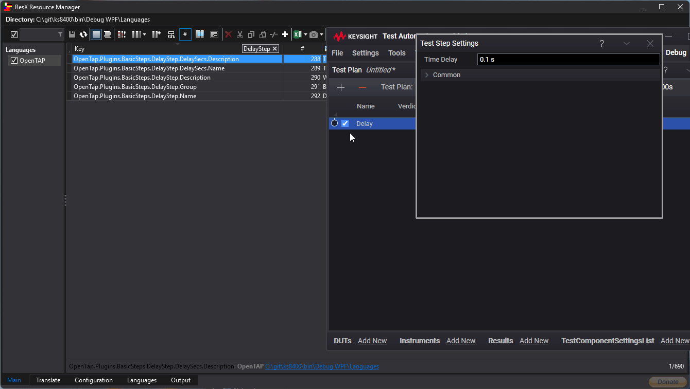

Release Notes - OpenTAP 9.29.0 
 ============= 

Highlights
 ---------

### Update from .NET Framework to .NET 9

The default runtime of OpenTAP is now .NET 9. This brings performance
improvements across the board, and gives plugins access to modern .NET APIs.

.NET 9 is mostly backwards compatible with .NET Framework, with some
exceptions. If you are a plugin author, please review the [migration
guide](https://doc.opentap.io/Developer%20Guide/Migrating%20to%20.NET%209/Readme.html)
to see if your plugins are affected.

### Multi-language support

Most text in user interfaces can now be translated with translation files.
Translations can be provided piecemeal in different files, so creating a
partial translation of several different 3rd party plugins is possible.

Translations updates are automatically detected at runtime, and integrates with
existing translation tooling such as [ResX Resource Manager](https://github.com/dotnet/ResXResourceManager).

See the [translation
documentation](https://doc.opentap.io/Developer%20Guide/Translating/Readme.html)
for details about creating translations.

### Enhanced Mixin functionality

OpenTAP now supports more use cases for `ITestStepPreRunMixin` and
`ITestStepPostRunMixin`:

* Mixin execution order can now be controlled by implementing the
  `ITestStepPreRunMixinOrder` and `ITestStepPostRunMixinOrder` interfaces
* Mixins can now set the `StepRun.Exception` property, enabling features such as validating properties just before a step is run. When the Exception is set, the step will fail with an error verdict. If it occured in the PreRunMixin, the step will not be run when the exception is set.
* Mixins can now set the `StepRun.SuggestedNextStep` property, enabling features such as a jump before or after a step is run. This can be combined with the new jump to arbitrary step feature.

New Features
 ------- 

- Improved Hex format for unit attribute [#2064](https://github.com/opentap/opentap/issues/2064)
- Added API to allow editing paused test plans [#2048](https://github.com/opentap/opentap/issues/2048)
- Test Plan Summary limit is now configurable [#1966](https://github.com/opentap/opentap/issues/1966)
- Added multi-language support [#1696](https://github.com/opentap/opentap/issues/1696)
- Sweep Parameter Range can now take the unit of the swept parameter [#2065](https://github.com/opentap/opentap/issues/2065)
- PreRunMixin can now set SuggestedNextStep [#2018](https://github.com/opentap/opentap/issues/2018)

Bug Fixes 
 ------- 

- Session.Create() no longer throws a NullReferenceException if a ComponentSettings<> throws an exception in its constructor [#2009](https://github.com/opentap/opentap/issues/2009)
- Input&lt;T&gt; ToString no longer throws an exception when target step is deleted [#1977](https://github.com/opentap/opentap/issues/1977)
- Package install now works when dotnet is not in PATH [#2062](https://github.com/opentap/opentap/issues/2062)
- HttpPackagRepository: GetPackageNames now uses distinctName [#1999](https://github.com/opentap/opentap/issues/1999)

Other 
 ------- 

- SDK templates: Update  C# language version to 12.0 or greater [#1935](https://github.com/opentap/opentap/issues/1935)

