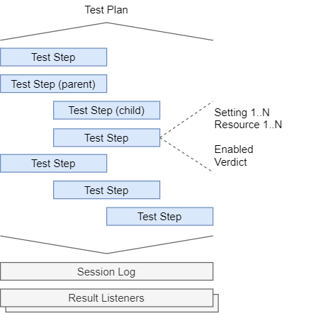

# Overview
This section introduces essential OpenTAP terminology, concepts, and tools. It is intended to provide users with an
 understanding of OpenTAP and its ecosystem to get started. For a more technical description, see the [Developer
 Guide](../../Developer%20Guide/Introduction). For a quick reference of CLI options, see the [comprehensive
 reference](../CLI%20Reference).

OpenTAP consists of multiple tools, including:
-	OpenTAP - core engine
-	CLI - command line interface for installed plugins, and
-  Package Manager - a tool to manage installed plugins

This overview is dedicated to OpenTAP itself. A detailed description, along with common usage scenarios, of the latter
two tools will be given in the following chapters.

## Test Plans

A *test plan* is a sequence of test steps and their associated data. They are stored as XML files, and use the
".TapPlan" file extension. Test plans are created with an [editor](../Editors). They can be executed either in an
editor, or by using the `tap run` [CLI action](../CLI%20Usage). A test step can be a child step, a parent step, or both.
Therefore, a test plan is a recursive structure of test steps. This hierarchy is illustrated in the figure below.



The step sequence is ordered from top to bottom, and child steps are indented to indicate that they belong to a parent step.

The execution order of child steps is decided by the parent step. For example, two typical parent steps are *Parallel*
and *Sequential*, shown below. *Nonsense Step* is not real, and is given as an example to illustrate that the topology
of test execution can be controlled entirely by a parent step.


``` ascii
-------------------------- TIME --------------------------->

SEQUENTIAL STEP
 ---------   ---------   ---------   ---------   ---------
| Child 1 | | Child 2 | | Child 3 | | Child 4 | | Child 5 |
 ---------   ---------   ---------   ---------   ---------


PARALLEL STEP
 ---------
| Child 1 |
 ---------
 ---------
| Child 2 |
 ---------
 ---------
| Child 3 |
 ---------

 NONSENSE STEP
 -------         -------         -------         -------
| Child |       | Child |       | Child |       | Child |
 -------         -------         -------         -------
         -------         -------         -------
        | Child |       | Child |       | Child |
         -------         -------         -------
 -------         -------         -------         -------
| Child |       | Child |       | Child |       | Child |
 -------         -------         -------         -------
```


## Test Steps

A test step is an element which encapsulates some piece of functionality. It should perform a single *step* of the test
being run. The definition given is intentionally vague, as a step can perform a myriad of actions. It could make a
measurement using an instrument, or control a piece of hardware such as adjusting fan speed or voltage. It could also
pause test exection, open a dialog window, make a web
request, run a different program, or control the execution of other
steps.

The *associated data* of test steps mentioned previously can be seen in the figure, namely *step settings* and
*resources*. *Enabled* is a common setting available on any step indicating whether or not it should be run. This is
useful for temporarily disabling certain steps without making destructive changes to a plan. In addition, all steps can
be named. Test steps all have a verdict. However, this verdict is not a part of the actual test plan. Rather, it is
*set* during execution of the the test plan. These elements are shown *inside* the test plan because they directly
affect execution behavior.

On the other hand, *Session Log* and *Result Listeners* are situated outside of the test plan because they interpret the
output of the test, and do not influence it directly. Ensuring this decoupling between generation and interpretation of
results guarantees that, say, a new database can be added to store results without making any changes to the test steps,
or their execution.
<!-- Result listeners are discussed in more detail in the [editor section](../Editors). -->

<!-- For further discussion of test steps, see the [test step discussion section](../Test%20Steps). -->

## Verdicts

*NotSet* is the default verdict for all test steps. A step can *set* a verdict during execution to indicate success. If
everything went as expected, a test step will set the *Pass* verdict. A test plan ouputs a verdict according to the
verdicts of its steps. The verdict of a test plan is the most *severe* verdict of its child steps. A
verdict has one of 6 severities, detailed in the table below.
| Severity | Verdict      | Description                                                        |
|----------|--------------|--------------------------------------------------------------------|
| 1        | NotSet       | No verdict was set                                                 |
| 2        | Pass         | Step or plan passed                                                |
| 3        | Inconclusive | Insufficient information to make a decision either way             |
| 4        | Fail         | Step or plan failed                                                |
| 5        | Aborted      | User aborted test plan                                             |
| 6        | Error        | An error occurred. Check [session logs](#session%20logs) for more information |

This means that, for a test plan to output a *Pass* verdict, at least one step must set their verdict to *Pass*, and
the rest must either set their verdict to *Pass* or *NotSet* verdict. This is also the most typical behavior for parent steps
containing child steps; a *Sequential* step passes if all of its children pass. However, this is not a rule. Parent
steps decide their own verdict conditions.

## Resources

OpenTAP is intended for software as well as hardware testing. The concept of Instruments and DUTs (plural of Device
Under Test) are essential for OpenTAP. In the classical case, a DUT is a device under test, calibration, or control, and
an instrument is anything that makes measurements. To integrate resources into test plans, whether to control them or
read their measurements, they must be connected to test steps that know how to communicate with them. In other words, a
resource driver is required. Creation of such a driver is described in the [Developer
Guide](../../Developer%20Guide/Instrument%20Plugin%20Development/#instrument-plugin-development).

OpenTAP is quite flexible regarding resources. Typically, they would be local, physical equipment. But they can easily
be more abstract, such as a virtual resource, or even a remote resource. Depending on your use case, all of the
following scenarios are valid:

 1. Having no DUTs or instruments
 2. Using a single device as a DUT and an instrument simultaneously
 3. Using software resources as DUTs or instruments
 4. Using many DUTs and instruments

Out of the box, OpenTAP does not provide any resources for hardware control. For that, you need plugins.

## Result Listeners

Result listeners are notified whenever a test step generates log output, or publishes results.

OpenTAP ships with a simple result listener called *Text Log*, which saves log information from a test plan run to a
file. Its behavior can be modified via settings, including changing the file name and location of the log, as well as
filtering the log information. There are 4 message categories: Errors, Warnings, Information, and Debug, each of which
can be checked and unchecked.

Analogous to *Text Log*, there is a result listener plugin named *CSV*. Rather than logging information, this plugin
saves all results published by test steps to a CSV file, which can also be changed via settings.

There are also PostgreSQL and SQLite result listeners that store all results and logs from a test plan run, as well as a
copy of the test plan itself, making it possible to restore and run and old version of a test plan. The PostgreSQL
plugin be configured to use either a local database, or publish to a remote database.

There is no limit to the number of active result listeners, and you can have multiple result listeners of the same type.
For example, you could create two different *Text Log* listeners collecting Debug and Information log messages,
respectively. There are more result listeners available in the package repository, and developers can [make new result
listener plugins](../../Developer%20Guide/Result%20Listener/#custom-result-listeners) to suit their needs, such as
integrating with a different database technology, or uploading test results to a website.

Result listeners are tied to an OpenTAP installation, and not a test plan. Result listener settings are stored
in `%TAP_PATH%/Settings/Results.xml`. Like test plans, we do not recommend editing these by hand. However, they can be
generated and edited using our test plan editors.
<!-- Creation and further usage of result listeners will be covered in more detail in the [editor section](../Editors). -->

## Session Logs

OpenTAP keeps extensive session logs for debugging purposes. Session logs are kept from the 10 latest OpenTAP instances
launched, and are created independently of result listeners. Their content is similar to the logs collected by *Text
Log*, but also contain diagnostic messages from OpenTAP and any plugin you may have installed. They can be found in
`%TAP_PATH%/SessionLogs`, and are named after the time and date at which they were created. They contain the same
information you would see in your terminal when running tap with the `--verbose` flag. If you encounter errors, the logs
may contain useful information for discovering what went wrong. If you think you discovered a bug in OpenTAP, please
file an issue on [gitlab](https://gitlab.com/OpenTAP/opentap). If applicable, please include instructions on how to
replicate the issue, as well as relevant logs.

## Packages and Plugins

OpenTAP can be extended with plugins. A plugin provides a single piece of functionality. For example, a plugin could
provide a new test step, or a new result listener. Plugins come in packages. A package is a versioned collection of
plugins. Plugins vary widely in the functionality they provide.

Some examples are:
 - [GUI editors](../Editors/#developer’s-system-community-edition) for creating and running test plans
 - SDK plugins to aid in developing and debugging plugins
 - Tools for analyzing test plans in real time to discover performance bottlenecks (Timing Analyzer)
 - REST interface to OpenTAP to allow you to control it remotely (REST-API)

Installing, uninstalling, upgrading, downgrading, and dependencies are all managed by the OpenTAP package manager. A
package declares its own dependencies and OS / CPU compatibility, and the package manager resolves those dependencies
with the packages in your current installation, if possible. Usage of the package manager is described in detail in [the
next section](../cli%20guide/package%manager).

The below figure shows the relation between plugins and OpenTAP. OpenTAP is at the center, and plugins, providing a
variety of functionality, can be added and removed painlessly. 

Check out our public package repository [here](http://packages.opentap.io/index.html#/?name=OpenTAP) to browse available
plugins.
